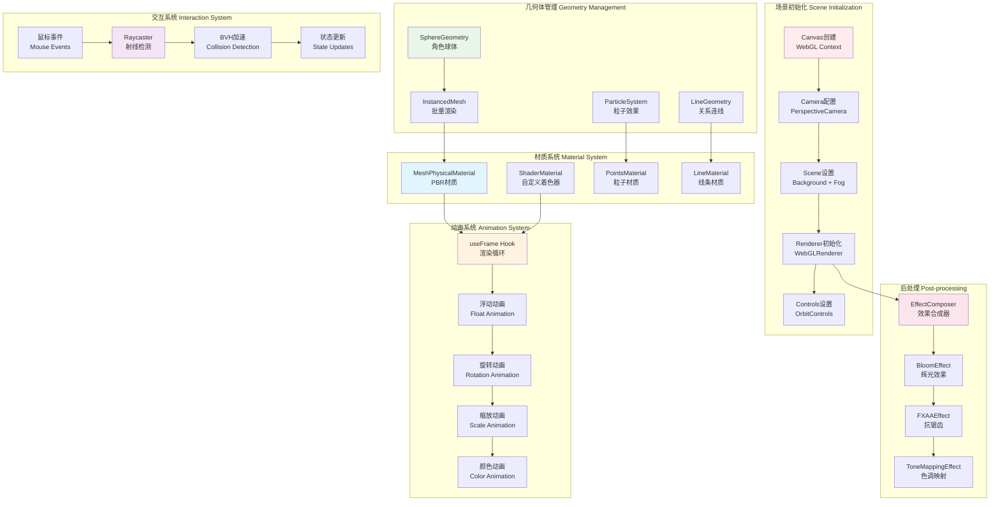
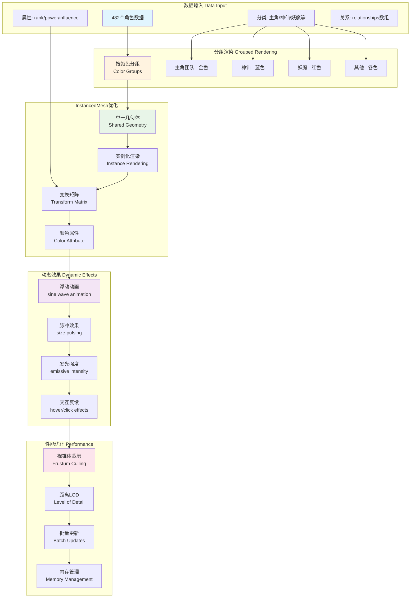
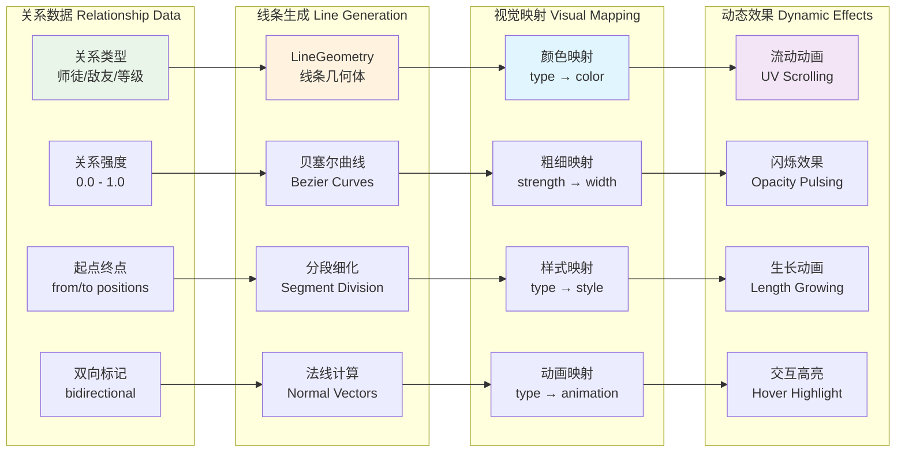
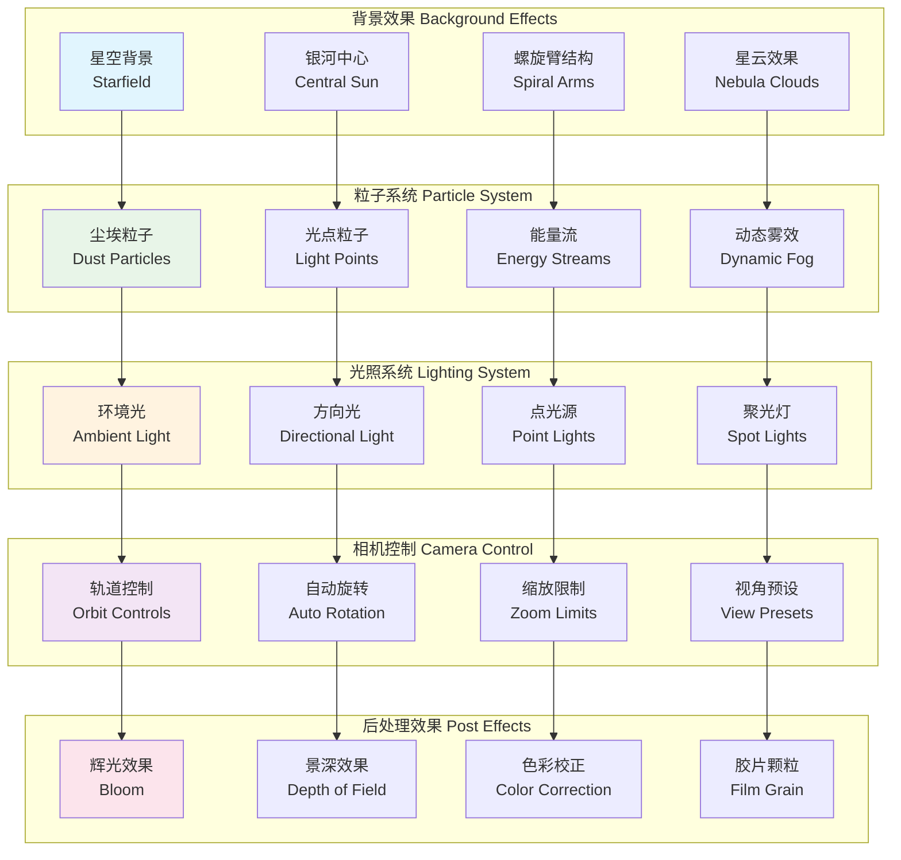
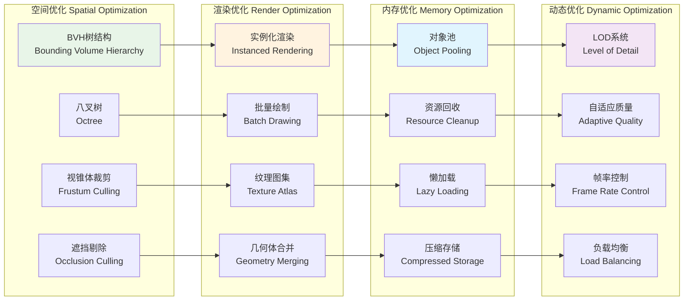

# 3D可视化渲染架构

## Three.js 渲染管线

```mermaid
graph TD
    subgraph "场景初始化 Scene Initialization"
        A[Canvas创建<br/>WebGL Context]
        B[Camera配置<br/>PerspectiveCamera]
        C[Scene设置<br/>Background + Fog]
        D[Renderer初始化<br/>WebGLRenderer]
        E[Controls设置<br/>OrbitControls]
    end
    
    subgraph "几何体管理 Geometry Management"
        F[SphereGeometry<br/>角色球体]
        G[InstancedMesh<br/>批量渲染]
        H[LineGeometry<br/>关系连线]
        I[ParticleSystem<br/>粒子效果]
    end
    
    subgraph "材质系统 Material System"
        J[MeshPhysicalMaterial<br/>PBR材质]
        K[ShaderMaterial<br/>自定义着色器]
        L[PointsMaterial<br/>粒子材质]
        M[LineMaterial<br/>线条材质]
    end
    
    subgraph "动画系统 Animation System"
        N[useFrame Hook<br/>渲染循环]
        O[浮动动画<br/>Float Animation]
        P[旋转动画<br/>Rotation Animation]
        Q[缩放动画<br/>Scale Animation]
        R[颜色动画<br/>Color Animation]
    end
    
    subgraph "交互系统 Interaction System"
        S[Raycaster<br/>射线检测]
        T[鼠标事件<br/>Mouse Events]
        U[BVH加速<br/>Collision Detection]
        V[状态更新<br/>State Updates]
    end
    
    subgraph "后处理 Post-processing"
        W[EffectComposer<br/>效果合成器]
        X[BloomEffect<br/>辉光效果]
        Y[FXAAEffect<br/>抗锯齿]
        Z[ToneMappingEffect<br/>色调映射]
    end
    
    A --> B --> C --> D --> E
    F --> G
    G --> J
    H --> M
    I --> L
    J --> N
    K --> N
    N --> O --> P --> Q --> R
    T --> S --> U --> V
    D --> W --> X --> Y --> Z
    
    style A fill:#ffebee
    style F fill:#e8f5e8
    style J fill:#e1f5fe
    style N fill:#fff3e0
    style S fill:#f3e5f5
    style W fill:#fce4ec
```

## 角色球体渲染系统

```mermaid
graph TB
    subgraph "数据输入 Data Input"
        A[482个角色数据]
        B[分类: 主角/神仙/妖魔等]
        C[属性: rank/power/influence]
        D[关系: relationships数组]
    end
    
    subgraph "分组渲染 Grouped Rendering"
        E[按颜色分组<br/>Color Groups]
        F[主角团队 - 金色]
        G[神仙 - 蓝色]
        H[妖魔 - 红色]
        I[其他 - 各色]
    end
    
    subgraph "InstancedMesh优化"
        J[单一几何体<br/>Shared Geometry]
        K[实例化渲染<br/>Instance Rendering]
        L[变换矩阵<br/>Transform Matrix]
        M[颜色属性<br/>Color Attribute]
    end
    
    subgraph "动态效果 Dynamic Effects"
        N[浮动动画<br/>sine wave animation]
        O[脉冲效果<br/>size pulsing]
        P[发光强度<br/>emissive intensity]
        Q[交互反馈<br/>hover/click effects]
    end
    
    subgraph "性能优化 Performance"
        R[视锥体裁剪<br/>Frustum Culling]
        S[距离LOD<br/>Level of Detail]
        T[批量更新<br/>Batch Updates]
        U[内存管理<br/>Memory Management]
    end
    
    A --> E
    B --> F
    B --> G
    B --> H
    B --> I
    C --> L
    E --> J
    J --> K
    K --> L
    L --> M
    M --> N
    N --> O
    O --> P
    P --> Q
    Q --> R
    R --> S
    S --> T
    T --> U
    
    style A fill:#e1f5fe
    style E fill:#fff3e0
    style J fill:#e8f5e8
    style N fill:#f3e5f5
    style R fill:#fce4ec
```

## 关系连线渲染系统

```mermaid
graph LR
    subgraph "关系数据 Relationship Data"
        A[关系类型<br/>师徒/敌友/等级]
        B[关系强度<br/>0.0 - 1.0]
        C[起点终点<br/>from/to positions]
        D[双向标记<br/>bidirectional]
    end
    
    subgraph "线条生成 Line Generation"
        E[LineGeometry<br/>线条几何体]
        F[贝塞尔曲线<br/>Bezier Curves]
        G[分段细化<br/>Segment Division]
        H[法线计算<br/>Normal Vectors]
    end
    
    subgraph "视觉映射 Visual Mapping"
        I[颜色映射<br/>type → color]
        J[粗细映射<br/>strength → width]
        K[样式映射<br/>type → style]
        L[动画映射<br/>type → animation]
    end
    
    subgraph "动态效果 Dynamic Effects"
        M[流动动画<br/>UV Scrolling]
        N[闪烁效果<br/>Opacity Pulsing]
        O[生长动画<br/>Length Growing]
        P[交互高亮<br/>Hover Highlight]
    end
    
    A --> E
    B --> F
    C --> G
    D --> H
    E --> I
    F --> J
    G --> K
    H --> L
    I --> M
    J --> N
    K --> O
    L --> P
    
    style A fill:#e8f5e8
    style E fill:#fff3e0
    style I fill:#e1f5fe
    style M fill:#f3e5f5
```

## 银河系场景效果

```mermaid
graph TD
    subgraph "背景效果 Background Effects"
        A[星空背景<br/>Starfield]
        B[银河中心<br/>Central Sun]
        C[螺旋臂结构<br/>Spiral Arms]
        D[星云效果<br/>Nebula Clouds]
    end
    
    subgraph "粒子系统 Particle System"
        E[尘埃粒子<br/>Dust Particles]
        F[光点粒子<br/>Light Points]
        G[能量流<br/>Energy Streams]
        H[动态雾效<br/>Dynamic Fog]
    end
    
    subgraph "光照系统 Lighting System"
        I[环境光<br/>Ambient Light]
        J[方向光<br/>Directional Light]
        K[点光源<br/>Point Lights]
        L[聚光灯<br/>Spot Lights]
    end
    
    subgraph "相机控制 Camera Control"
        M[轨道控制<br/>Orbit Controls]
        N[自动旋转<br/>Auto Rotation]
        O[缩放限制<br/>Zoom Limits]
        P[视角预设<br/>View Presets]
    end
    
    subgraph "后处理效果 Post Effects"
        Q[辉光效果<br/>Bloom]
        R[景深效果<br/>Depth of Field]
        S[色彩校正<br/>Color Correction]
        T[胶片颗粒<br/>Film Grain]
    end
    
    A --> E
    B --> F
    C --> G
    D --> H
    E --> I
    F --> J
    G --> K
    H --> L
    I --> M
    J --> N
    K --> O
    L --> P
    M --> Q
    N --> R
    O --> S
    P --> T
    
    style A fill:#e1f5fe
    style E fill:#e8f5e8
    style I fill:#fff3e0
    style M fill:#f3e5f5
    style Q fill:#fce4ec
```

## 性能优化策略

```mermaid
flowchart LR
    subgraph "空间优化 Spatial Optimization"
        A[BVH树结构<br/>Bounding Volume Hierarchy]
        B[八叉树<br/>Octree]
        C[视锥体裁剪<br/>Frustum Culling]
        D[遮挡剔除<br/>Occlusion Culling]
    end
    
    subgraph "渲染优化 Render Optimization"
        E[实例化渲染<br/>Instanced Rendering]
        F[批量绘制<br/>Batch Drawing]
        G[纹理图集<br/>Texture Atlas]
        H[几何体合并<br/>Geometry Merging]
    end
    
    subgraph "内存优化 Memory Optimization"
        I[对象池<br/>Object Pooling]
        J[资源回收<br/>Resource Cleanup]
        K[懒加载<br/>Lazy Loading]
        L[压缩存储<br/>Compressed Storage]
    end
    
    subgraph "动态优化 Dynamic Optimization"
        M[LOD系统<br/>Level of Detail]
        N[自适应质量<br/>Adaptive Quality]
        O[帧率控制<br/>Frame Rate Control]
        P[负载均衡<br/>Load Balancing]
    end
    
    A --> E
    B --> F
    C --> G
    D --> H
    E --> I
    F --> J
    G --> K
    H --> L
    I --> M
    J --> N
    K --> O
    L --> P
    
    style A fill:#e8f5e8
    style E fill:#fff3e0
    style I fill:#e1f5fe
    style M fill:#f3e5f5
```
