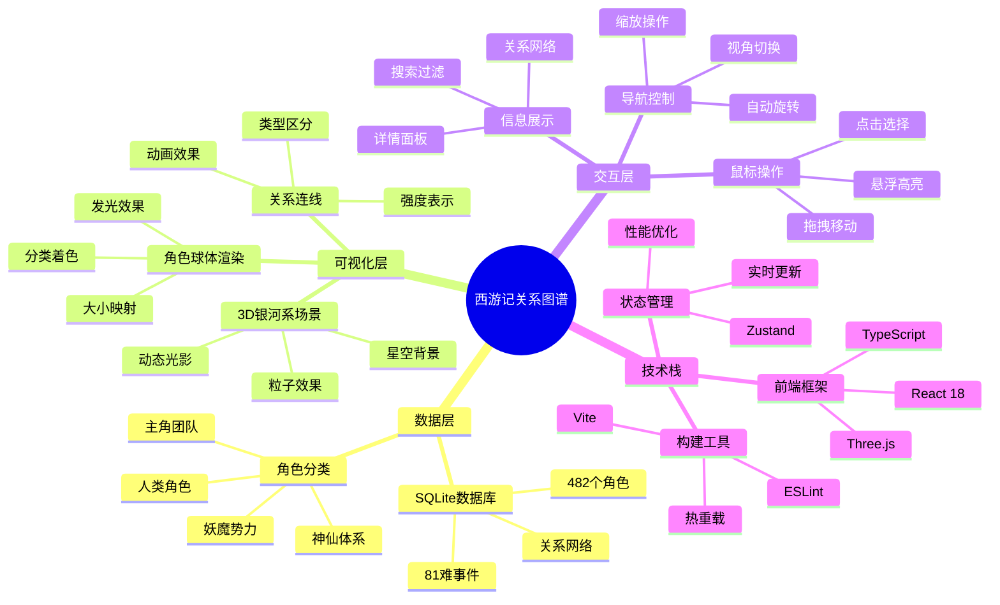

# 西游记人物关系图谱 - 完整技术文档

## 文档导航

本文档集详细分析了西游记人物关系图谱3D可视化项目的完整技术架构。

### 📋 文档列表

1. **[系统架构图](./system-architecture.md)** - 整体技术架构与模块关系
2. **[人物关系网络图](./character-relationship-network.md)** - 角色关系建模与可视化
3. **[数据库架构图](./database-architecture.md)** - 数据存储与关系建模
4. **[3D可视化架构图](./3d-visualization-architecture.md)** - Three.js渲染管线与优化
5. **[交互系统设计图](./interaction-system.md)** - 用户交互与体验设计
6. **[开发部署流程图](./development-deployment.md)** - 项目开发与运维流程

### 🎯 项目概述



### 🚀 核心特性

#### 1. 数据驱动的关系网络
- **482个角色数据** - 涵盖西游记中的主要和次要人物
- **多维度关系建模** - 师徒、敌友、等级、血缘等关系类型
- **动态关系强度** - 基于情节发展的关系变化分析
- **智能分类系统** - 自动识别角色类型和所属势力

#### 2. 沉浸式3D可视化
- **银河系风格场景** - 以宇宙为背景的宏大视觉效果
- **实时渲染引擎** - 基于Three.js的高性能3D渲染
- **智能空间布局** - 根据角色属性的三维空间分布算法
- **动态视觉效果** - 粒子系统、光影效果、后处理管线

#### 3. 智能交互体验
- **多层级导航** - 从全景到细节的渐进式信息呈现
- **实时反馈系统** - 鼠标交互的即时视觉响应
- **自适应界面** - 响应式设计适配不同设备和屏幕
- **性能优化** - BVH空间索引、LOD系统、批量渲染

### 📊 技术指标

| 指标项 | 数值 | 说明 |
|--------|------|------|
| 角色总数 | 482个 | 包含主要角色和别名 |
| 事件数量 | 81个 | 对应西游记八十一难 |
| 渲染性能 | 60FPS | 在现代设备上的目标帧率 |
| 内存占用 | <500MB | 浏览器内存使用上限 |
| 加载时间 | <3秒 | 首次加载完成时间 |
| 响应时间 | <100ms | 交互操作响应延迟 |

### 🏗️ 架构优势

#### 1. 模块化设计
```
├── 数据层 (Data Layer)
│   ├── SQLite数据库
│   ├── Express API服务
│   └── 数据映射组件
├── 业务层 (Business Layer)
│   ├── 关系分析引擎
│   ├── 空间布局算法
│   └── 交互逻辑处理
├── 表现层 (Presentation Layer)
│   ├── Three.js渲染引擎
│   ├── React组件系统
│   └── 用户界面控制
└── 基础层 (Infrastructure Layer)
    ├── 性能监控系统
    ├── 错误处理机制
    └── 配置管理工具
```

#### 2. 性能优化策略
- **空间索引** - BVH树结构加速碰撞检测
- **批量渲染** - InstancedMesh减少绘制调用
- **视锥体裁剪** - 智能剔除不可见对象
- **内存管理** - 对象池和资源回收机制

#### 3. 扩展性设计
- **插件化架构** - 支持功能模块的动态加载
- **配置驱动** - 通过配置文件控制渲染参数
- **API标准化** - RESTful接口便于集成扩展
- **组件化开发** - React组件的可重用性

### 🔮 未来发展

#### 1. 功能扩展规划
- **VR/AR支持** - 虚拟现实和增强现实体验
- **AI智能分析** - 机器学习辅助关系挖掘
- **多语言支持** - 国际化界面和内容
- **社交功能** - 用户协作和内容分享

#### 2. 技术演进方向
- **WebGPU集成** - 下一代图形API应用
- **WebAssembly优化** - 计算密集任务加速
- **Progressive Web App** - 原生应用体验
- **边缘计算** - CDN节点计算分发

### 📖 使用指南

#### 开发环境搭建
```bash
# 克隆项目
git clone https://github.com/weisiren000/xiyouji-rela-map.git

# 安装依赖
pnpm install

# 启动开发服务器
pnpm dev

# 构建生产版本
pnpm build
```

#### 主要命令
```bash
pnpm dev          # 开发模式
pnpm build        # 构建项目
pnpm preview      # 预览构建结果
pnpm server       # 启动后端服务
pnpm start:all    # 同时启动前后端
```

### 📄 许可证

本项目采用 MIT 许可证，详见 [LICENSE](../LICENSE) 文件。

### 🤝 贡献指南

欢迎提交 Issue 和 Pull Request 来改进这个项目。请确保：

1. 遵循现有的代码风格
2. 添加适当的测试用例
3. 更新相关文档
4. 通过所有检查流程

### 📞 联系方式

- 项目主页: [GitHub Repository](https://github.com/weisiren000/xiyouji-rela-map)
- 问题反馈: [GitHub Issues](https://github.com/weisiren000/xiyouji-rela-map/issues)
- 文档更新: 2025年6月30日

---

> 这是一个开源项目，旨在通过现代Web技术展示中国古典文学的魅力。
> 项目结合了数据可视化、3D图形学、人机交互等多个技术领域的最佳实践。
