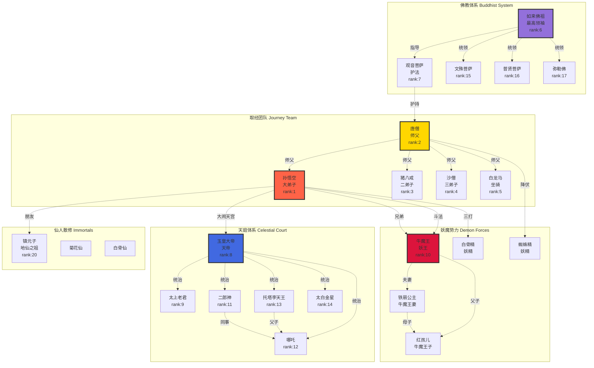
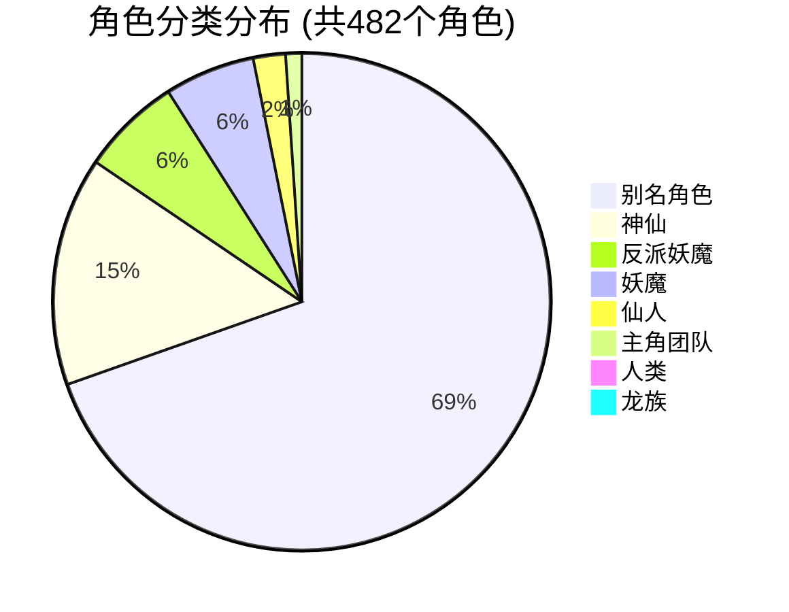
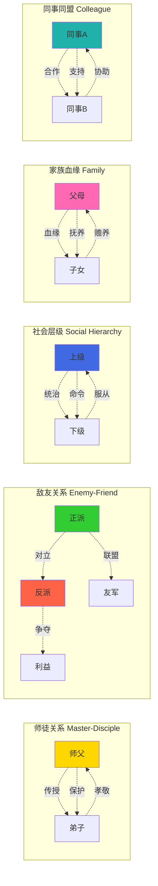
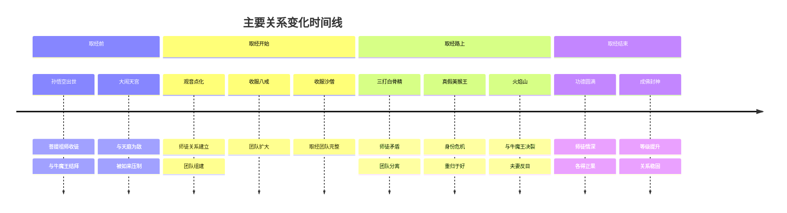
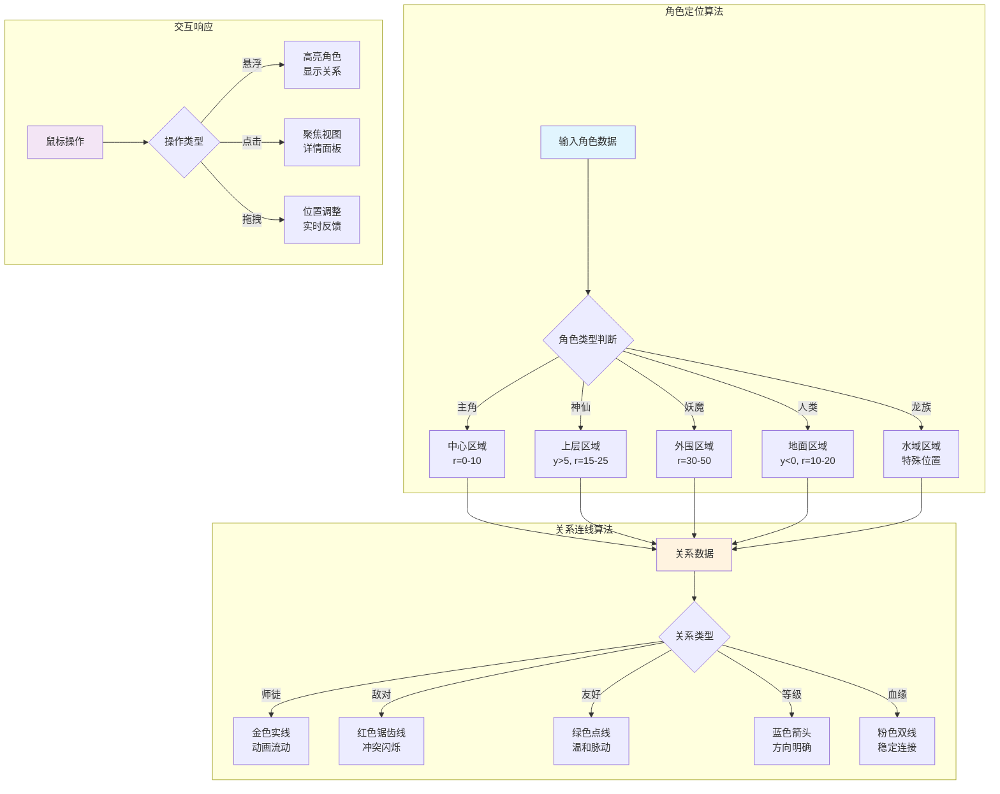

# 西游记人物关系网络图谱

## 核心人物关系网络

```mermaid
graph TB
    subgraph "取经团队 Journey Team"
        T[唐僧<br/>师父<br/>rank:2]
        SW[孙悟空<br/>大弟子<br/>rank:1]
        ZBJ[猪八戒<br/>二弟子<br/>rank:3]
        SS[沙僧<br/>三弟子<br/>rank:4]
        BLM[白龙马<br/>坐骑<br/>rank:5]
    end
    
    subgraph "佛教体系 Buddhist System"
        RL[如来佛祖<br/>最高领袖<br/>rank:6]
        GY[观音菩萨<br/>护法<br/>rank:7]
        WS[文殊菩萨<br/>rank:15]
        PX[普贤菩萨<br/>rank:16]
        ML[弥勒佛<br/>rank:17]
    end
    
    subgraph "天庭体系 Celestial Court"
        YH[玉皇大帝<br/>天帝<br/>rank:8]
        TSLD[太上老君<br/>rank:9]
        EL[二郎神<br/>rank:11]
        NZ[哪吒<br/>rank:12]
        TTLT[托塔李天王<br/>rank:13]
        TB[太白金星<br/>rank:14]
    end
    
    subgraph "妖魔势力 Demon Forces"
        NMW[牛魔王<br/>妖王<br/>rank:10]
        TGJ[铁扇公主<br/>牛魔王妻]
        HHE[红孩儿<br/>牛魔王子]
        BGJ[白骨精<br/>妖精]
        ZZJ[蜘蛛精<br/>妖精]
    end
    
    subgraph "仙人散修 Immortals"
        ZYZ[镇元子<br/>地仙之祖<br/>rank:20]
        JGX[菊花仙]
        BGX[白骨仙]
    end
    
    %% 师徒关系 Master-Disciple
    T -.师父.-> SW
    T -.师父.-> ZBJ
    T -.师父.-> SS
    T -.师父.-> BLM
    
    %% 佛教指导关系 Buddhist Guidance
    RL -.指导.-> GY
    GY -.护持.-> T
    RL -.统领.-> WS
    RL -.统领.-> PX
    RL -.统领.-> ML
    
    %% 天庭等级关系 Celestial Hierarchy
    YH -.统治.-> TSLD
    YH -.统治.-> EL
    YH -.统治.-> NZ
    YH -.统治.-> TTLT
    YH -.统治.-> TB
    TTLT -.父子.-> NZ
    
    %% 家族关系 Family Relations
    NMW -.夫妻.-> TGJ
    NMW -.父子.-> HHE
    TGJ -.母子.-> HHE
    
    %% 敌对关系 Enemy Relations
    SW -.大闹天宫.-> YH
    SW -.三打.-> BGJ
    SW -.斗法.-> NMW
    T -.降伏.-> ZZJ
    
    %% 友好关系 Friendly Relations
    SW -.兄弟.-> NMW
    SW -.朋友.-> ZYZ
    EL -.同事.-> NZ
    
    style T fill:#FFD700,stroke:#333,stroke-width:3px
    style SW fill:#FF6347,stroke:#333,stroke-width:3px
    style RL fill:#9370DB,stroke:#333,stroke-width:3px
    style YH fill:#4169E1,stroke:#333,stroke-width:3px
    style NMW fill:#DC143C,stroke:#333,stroke-width:3px
```

## 角色分类与势力分布

```mermaid
pie title 角色分类分布 (共482个角色)
    "别名角色" : 332
    "神仙" : 71
    "反派妖魔" : 31
    "妖魔" : 28
    "仙人" : 10
    "主角团队" : 5
    "人类" : 3
    "龙族" : 2
```

## 关系类型分析

```mermaid
graph LR
    subgraph "师徒关系 Master-Disciple"
        A1[师父] -.传授.-> A2[弟子]
        A1 -.保护.-> A2
        A2 -.孝敬.-> A1
    end
    
    subgraph "敌友关系 Enemy-Friend"
        B1[正派] -.对立.-> B2[反派]
        B1 -.联盟.-> B3[友军]
        B2 -.争夺.-> B4[利益]
    end
    
    subgraph "社会层级 Social Hierarchy"
        C1[上级] -.统治.-> C2[下级]
        C1 -.命令.-> C2
        C2 -.服从.-> C1
    end
    
    subgraph "家族血缘 Family"
        D1[父母] -.血缘.-> D2[子女]
        D1 -.抚养.-> D2
        D2 -.赡养.-> D1
    end
    
    subgraph "同事同盟 Colleague"
        E1[同事A] -.合作.-> E2[同事B]
        E1 -.支持.-> E2
        E2 -.协助.-> E1
    end
    
    style A1 fill:#FFD700
    style B1 fill:#32CD32
    style B2 fill:#FF6347
    style C1 fill:#4169E1
    style D1 fill:#FF69B4
    style E1 fill:#20B2AA
```

## 事件驱动的关系变化

```mermaid
timeline
    title 主要关系变化时间线
    
    section 取经前
        孙悟空出世    : 菩提祖师收徒
                     : 与牛魔王结拜
        大闹天宫      : 与天庭为敌
                     : 被如来压制
    
    section 取经开始
        观音点化      : 师徒关系建立
                     : 团队组建
        收服八戒      : 团队扩大
        收服沙僧      : 取经团队完整
    
    section 取经路上
        三打白骨精    : 师徒矛盾
                     : 团队分离
        真假美猴王    : 身份危机
                     : 重归于好
        火焰山       : 与牛魔王决裂
                     : 夫妻反目
    
    section 取经结束
        功德圆满      : 师徒情深
                     : 各得正果
        成佛封神      : 等级提升
                     : 关系稳固
```

## 3D空间分布算法

```mermaid
graph TD
    subgraph "角色定位算法"
        A[输入角色数据] --> B{角色类型判断}
        B -->|主角| C[中心区域<br/>r=0-10]
        B -->|神仙| D[上层区域<br/>y>5, r=15-25]
        B -->|妖魔| E[外围区域<br/>r=30-50]
        B -->|人类| F[地面区域<br/>y<0, r=10-20]
        B -->|龙族| G[水域区域<br/>特殊位置]
    end
    
    subgraph "关系连线算法"
        H[关系数据] --> I{关系类型}
        I -->|师徒| J[金色实线<br/>动画流动]
        I -->|敌对| K[红色锯齿线<br/>冲突闪烁]
        I -->|友好| L[绿色点线<br/>温和脉动]
        I -->|等级| M[蓝色箭头<br/>方向明确]
        I -->|血缘| N[粉色双线<br/>稳定连接]
    end
    
    subgraph "交互响应"
        O[鼠标操作] --> P{操作类型}
        P -->|悬浮| Q[高亮角色<br/>显示关系]
        P -->|点击| R[聚焦视图<br/>详情面板]
        P -->|拖拽| S[位置调整<br/>实时反馈]
    end
    
    C --> H
    D --> H
    E --> H
    F --> H
    G --> H
    
    style A fill:#e1f5fe
    style H fill:#fff3e0
    style O fill:#f3e5f5
```
