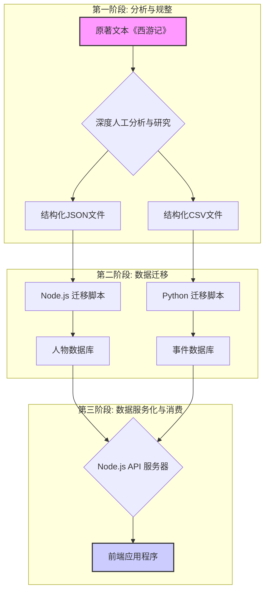

```mermaid
graph TD
    subgraph "第一阶段: 分析与规整"
        A["原著文本《西游记》"] --> B{"深度人工分析与研究"};
        B --> C["结构化JSON文件"]
        B --> D["结构化CSV文件"]
    end

    subgraph "第二阶段: 数据迁移"
        C --> E["Node.js 迁移脚本"];
        D --> F["Python 迁移脚本"];
        E --> G["人物数据库"];
        F --> H["事件数据库"];
    end

    subgraph "第三阶段: 数据服务化与消费"
        G --> I{"Node.js API 服务器"};
        H --> I;
        I --> J["前端应用程序"];
    end

    style A fill:#f9f,stroke:#333,stroke-width:2px
    style J fill:#ccf,stroke:#333,stroke-width:2px
```