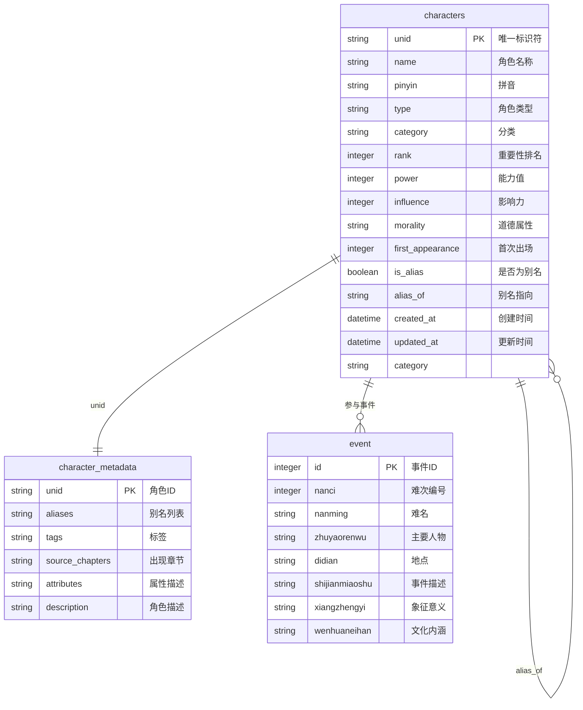
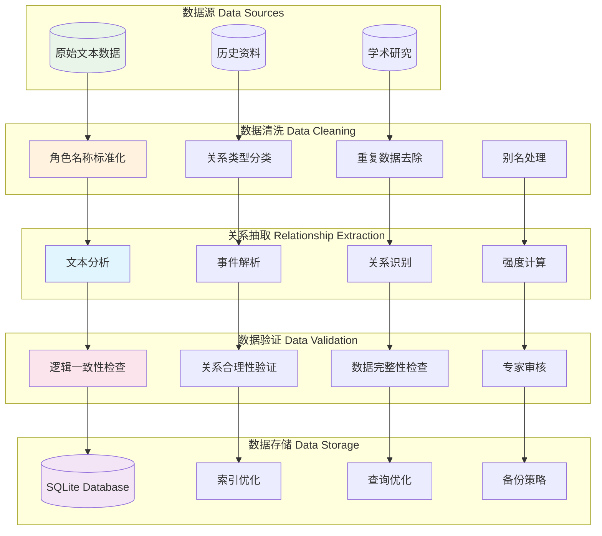
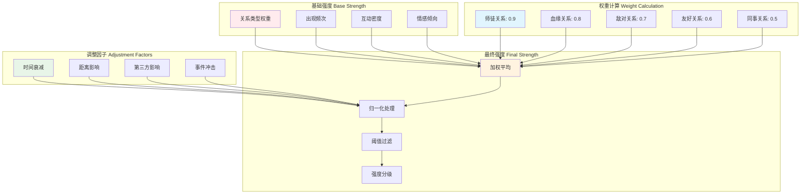
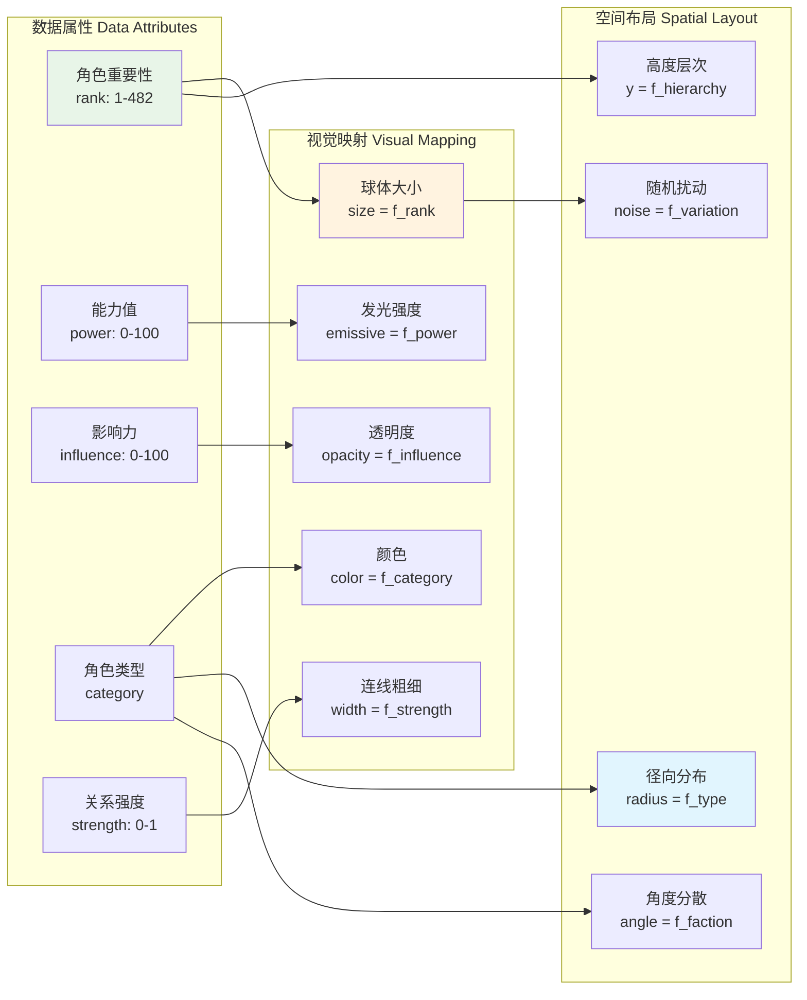

# 数据库架构与关系建模

## SQLite数据库结构



## 角色关系建模

```mermaid
classDiagram
    class Character {
        +string id
        +string name
        +string pinyin
        +CharacterType type
        +string faction
        +int rank
        +int power
        +int influence
        +Vector3 position
        +Relationship[] relationships
        +getRelatedCharacters()
        +calculateCentrality()
        +getVisualizationData()
    }
    
    class Relationship {
        +string id
        +string from
        +string to
        +RelationshipType type
        +float strength
        +boolean bidirectional
        +string description
        +calculateStrength()
        +getVisualization()
    }
    
    class Event {
        +int id
        +string name
        +string[] mainCharacters
        +string location
        +string description
        +getCharacterConnections()
        +analyzeRelationshipChanges()
    }
    
    class Faction {
        +string name
        +Character[] members
        +Relationship[] internalRelations
        +Relationship[] externalRelations
        +calculateCohesion()
        +analyzePowerStructure()
    }
    
    Character "1" --> "*" Relationship : has
    Relationship "*" --> "2" Character : connects
    Event "*" --> "*" Character : involves
    Faction "1" --> "*" Character : contains
    
    <<enumeration>> CharacterType
    CharacterType : PROTAGONIST
    CharacterType : DEITY
    CharacterType : DEMON
    CharacterType : HUMAN
    CharacterType : DRAGON
    CharacterType : CELESTIAL
    CharacterType : BUDDHIST
    CharacterType : UNDERWORLD
    
    <<enumeration>> RelationshipType
    RelationshipType : MASTER_DISCIPLE
    RelationshipType : FAMILY
    RelationshipType : FRIEND
    RelationshipType : ENEMY
    RelationshipType : COLLEAGUE
    RelationshipType : SUPERIOR
    RelationshipType : ALLIANCE
```

## 数据处理流程



## 关系强度计算算法



## 3D可视化数据映射


