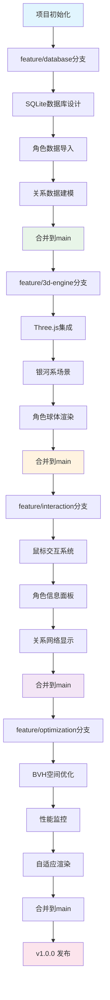
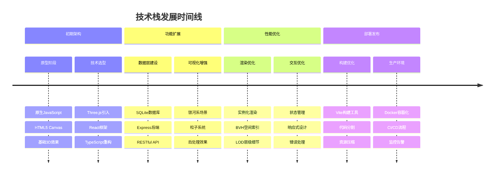
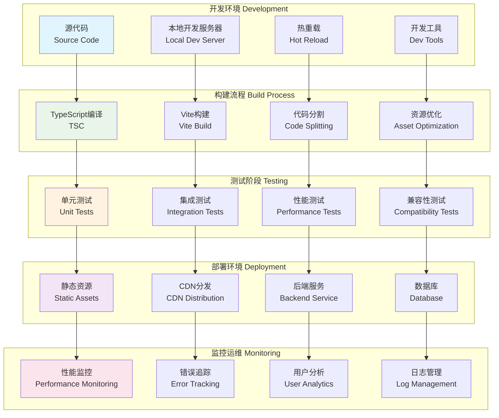
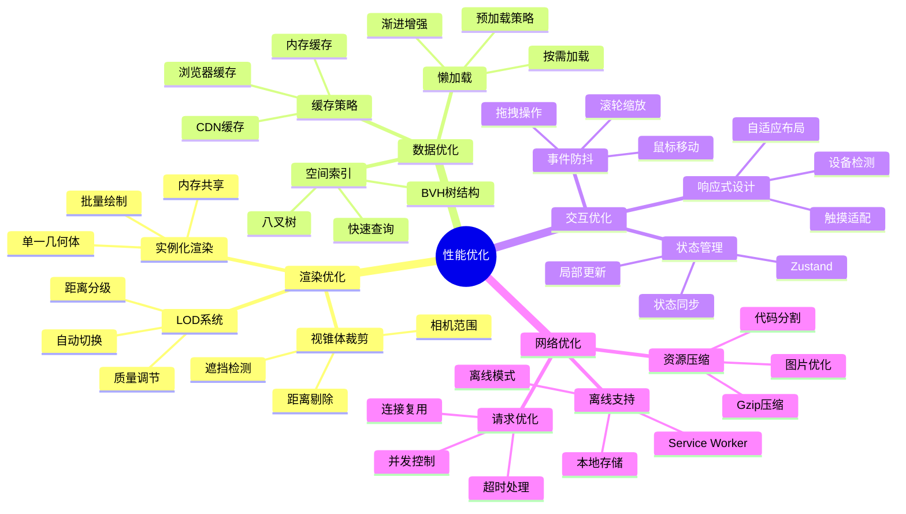
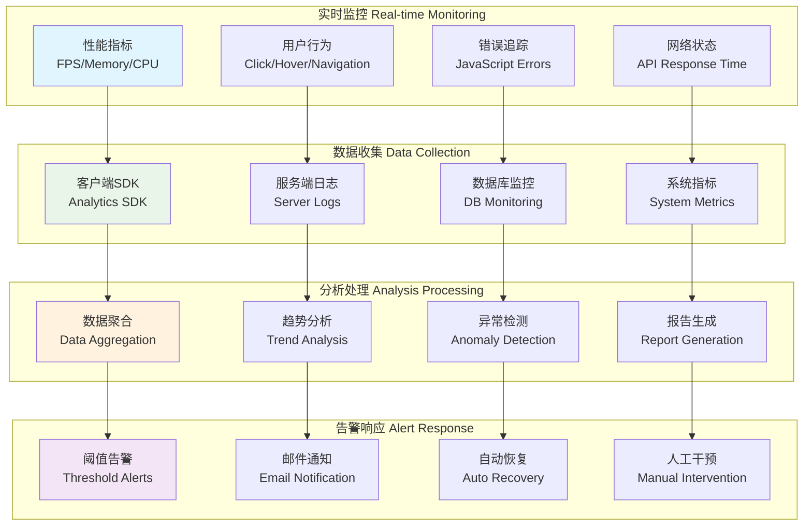
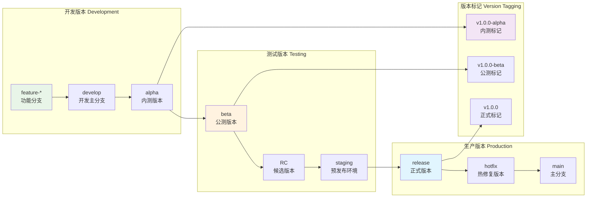

# 项目开发与部署流程

## 开发工作流程

```mermaid
flowchart TD
    A[项目初始化] --> B[feature/database分支]
    B --> C[SQLite数据库设计]
    C --> D[角色数据导入]
    D --> E[关系数据建模]
    E --> F[合并到main]
    
    F --> G[feature/3d-engine分支]
    G --> H[Three.js集成]
    H --> I[银河系场景]
    I --> J[角色球体渲染]
    J --> K[合并到main]
    
    K --> L[feature/interaction分支]
    L --> M[鼠标交互系统]
    M --> N[角色信息面板]
    N --> O[关系网络显示]
    O --> P[合并到main]
    
    P --> Q[feature/optimization分支]
    Q --> R[BVH空间优化]
    R --> S[性能监控]
    S --> T[自适应渲染]
    T --> U[合并到main]
    
    U --> V[v1.0.0 发布]
    
    style A fill:#e1f5fe
    style F fill:#e8f5e8
    style K fill:#fff3e0
    style P fill:#f3e5f5
    style V fill:#fce4ec
```

## 技术栈演进历程

```mermaid
timeline
    title 技术栈发展时间线
    
    section 初期架构
        原型阶段      : 原生JavaScript
                     : HTML5 Canvas
                     : 基础3D效果
        
        技术选型      : Three.js引入
                     : React框架
                     : TypeScript重构
    
    section 功能扩展
        数据层建设    : SQLite数据库
                     : Express后端
                     : RESTful API
        
        可视化增强    : 银河系场景
                     : 粒子系统
                     : 后处理效果
    
    section 性能优化
        渲染优化      : 实例化渲染
                     : BVH空间索引
                     : LOD层级细节
        
        交互优化      : 状态管理
                     : 响应式设计
                     : 错误处理
    
    section 部署发布
        构建优化      : Vite构建工具
                     : 代码分割
                     : 资源压缩
        
        生产环境      : Docker容器化
                     : CI/CD流程
                     : 监控告警
```

## 构建部署架构

```mermaid
graph TB
    subgraph "开发环境 Development"
        A[源代码<br/>Source Code]
        B[本地开发服务器<br/>Local Dev Server]
        C[热重载<br/>Hot Reload]
        D[开发工具<br/>Dev Tools]
    end
    
    subgraph "构建流程 Build Process"
        E[TypeScript编译<br/>TSC]
        F[Vite构建<br/>Vite Build]
        G[代码分割<br/>Code Splitting]
        H[资源优化<br/>Asset Optimization]
    end
    
    subgraph "测试阶段 Testing"
        I[单元测试<br/>Unit Tests]
        J[集成测试<br/>Integration Tests]
        K[性能测试<br/>Performance Tests]
        L[兼容性测试<br/>Compatibility Tests]
    end
    
    subgraph "部署环境 Deployment"
        M[静态资源<br/>Static Assets]
        N[CDN分发<br/>CDN Distribution]
        O[后端服务<br/>Backend Service]
        P[数据库<br/>Database]
    end
    
    subgraph "监控运维 Monitoring"
        Q[性能监控<br/>Performance Monitoring]
        R[错误追踪<br/>Error Tracking]
        S[用户分析<br/>User Analytics]
        T[日志管理<br/>Log Management]
    end
    
    A --> E
    B --> F
    C --> G
    D --> H
    E --> I
    F --> J
    G --> K
    H --> L
    I --> M
    J --> N
    K --> O
    L --> P
    M --> Q
    N --> R
    O --> S
    P --> T
    
    style A fill:#e1f5fe
    style E fill:#e8f5e8
    style I fill:#fff3e0
    style M fill:#f3e5f5
    style Q fill:#fce4ec
```

## CI/CD 流水线

```mermaid
graph LR
    subgraph "代码管理 Code Management"
        A[Git Repository]
        B[Feature Branch]
        C[Pull Request]
        D[Code Review]
    end
    
    subgraph "自动化构建 Automated Build"
        E[代码检查<br/>ESLint]
        F[类型检查<br/>TypeScript]
        G[单元测试<br/>Jest]
        H[构建打包<br/>Vite]
    end
    
    subgraph "质量检测 Quality Assurance"
        I[代码覆盖率<br/>Coverage]
        J[性能测试<br/>Performance]
        K[安全扫描<br/>Security Scan]
        L[依赖检查<br/>Dependency Check]
    end
    
    subgraph "部署发布 Deployment"
        M[预发布环境<br/>Staging]
        N[生产环境<br/>Production]
        O[回滚机制<br/>Rollback]
        P[健康检查<br/>Health Check]
    end
    
    A --> B --> C --> D
    D --> E --> F --> G --> H
    H --> I --> J --> K --> L
    L --> M --> N --> O --> P
    
    style A fill:#e8f5e8
    style E fill:#fff3e0
    style I fill:#e1f5fe
    style M fill:#f3e5f5
```

## 性能优化策略图

```mermaid
mindmap
  root((性能优化))
    渲染优化
      实例化渲染
        单一几何体
        批量绘制
        内存共享
      视锥体裁剪
        相机范围
        距离剔除
        遮挡检测
      LOD系统
        距离分级
        自动切换
        质量调节
    
    数据优化
      空间索引
        BVH树结构
        八叉树
        快速查询
      缓存策略
        内存缓存
        浏览器缓存
        CDN缓存
      懒加载
        按需加载
        渐进增强
        预加载策略
    
    交互优化
      事件防抖
        鼠标移动
        滚轮缩放
        拖拽操作
      状态管理
        Zustand
        局部更新
        状态同步
      响应式设计
        自适应布局
        触摸适配
        设备检测
    
    网络优化
      资源压缩
        Gzip压缩
        图片优化
        代码分割
      请求优化
        连接复用
        并发控制
        超时处理
      离线支持
        Service Worker
        本地存储
        离线模式
```

## 监控与维护体系

```mermaid
graph TD
    subgraph "实时监控 Real-time Monitoring"
        A[性能指标<br/>FPS/Memory/CPU]
        B[用户行为<br/>Click/Hover/Navigation]
        C[错误追踪<br/>JavaScript Errors]
        D[网络状态<br/>API Response Time]
    end
    
    subgraph "数据收集 Data Collection"
        E[客户端SDK<br/>Analytics SDK]
        F[服务端日志<br/>Server Logs]
        G[数据库监控<br/>DB Monitoring]
        H[系统指标<br/>System Metrics]
    end
    
    subgraph "分析处理 Analysis Processing"
        I[数据聚合<br/>Data Aggregation]
        J[趋势分析<br/>Trend Analysis]
        K[异常检测<br/>Anomaly Detection]
        L[报告生成<br/>Report Generation]
    end
    
    subgraph "告警响应 Alert Response"
        M[阈值告警<br/>Threshold Alerts]
        N[邮件通知<br/>Email Notification]
        O[自动恢复<br/>Auto Recovery]
        P[人工干预<br/>Manual Intervention]
    end
    
    A --> E
    B --> F
    C --> G
    D --> H
    E --> I
    F --> J
    G --> K
    H --> L
    I --> M
    J --> N
    K --> O
    L --> P
    
    style A fill:#e1f5fe
    style E fill:#e8f5e8
    style I fill:#fff3e0
    style M fill:#f3e5f5
```

## 版本发布策略

```mermaid
graph LR
    subgraph "开发版本 Development"
        A[feature-*<br/>功能分支]
        B[develop<br/>开发主分支]
        C[alpha<br/>内测版本]
    end
    
    subgraph "测试版本 Testing"
        D[beta<br/>公测版本]
        E[RC<br/>候选版本]
        F[staging<br/>预发布环境]
    end
    
    subgraph "生产版本 Production"
        G[release<br/>正式版本]
        H[hotfix<br/>热修复版本]
        I[main<br/>主分支]
    end
    
    subgraph "版本标记 Version Tagging"
        J[v1.0.0-alpha<br/>内测标记]
        K[v1.0.0-beta<br/>公测标记]
        L[v1.0.0<br/>正式标记]
    end
    
    A --> B --> C
    C --> D --> E --> F
    F --> G --> H --> I
    C --> J
    D --> K
    G --> L
    
    style A fill:#e8f5e8
    style D fill:#fff3e0
    style G fill:#e1f5fe
    style J fill:#f3e5f5
```
