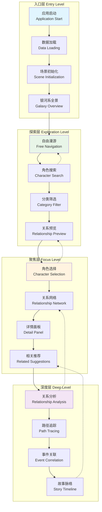
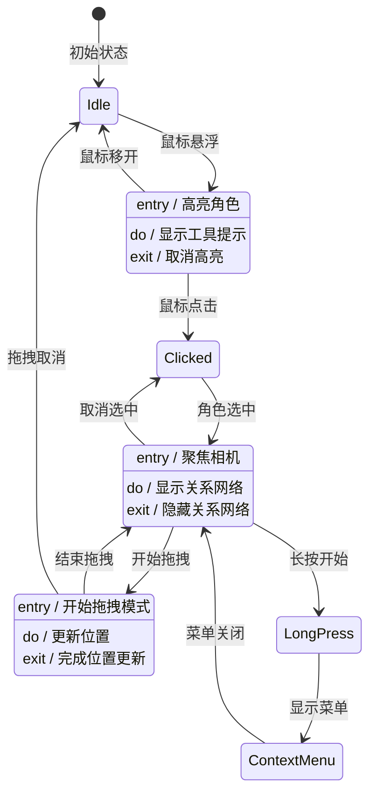
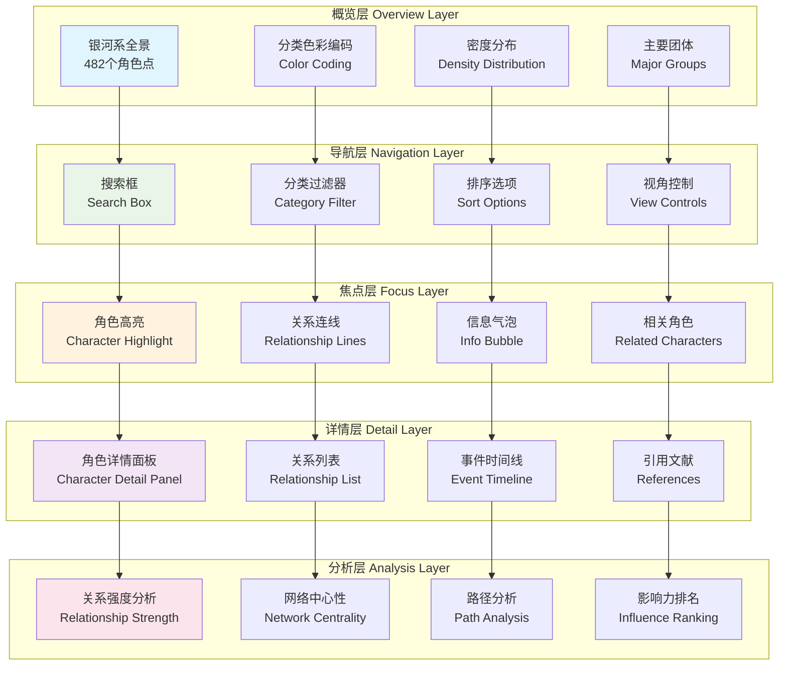
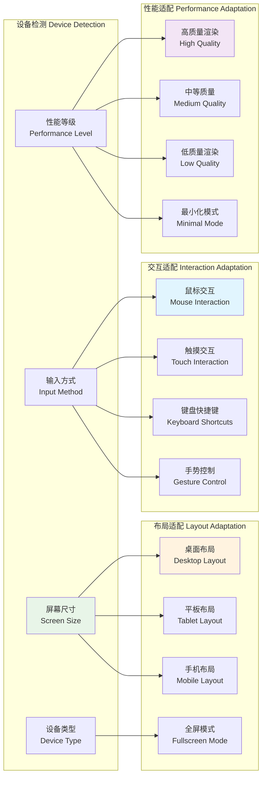
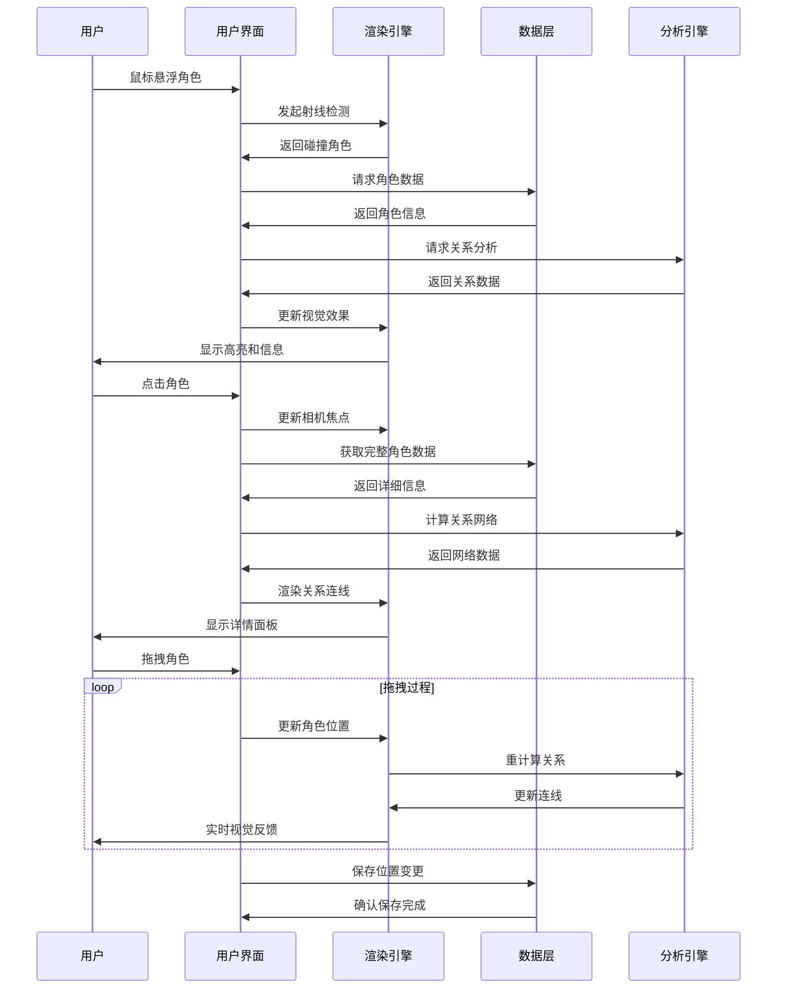
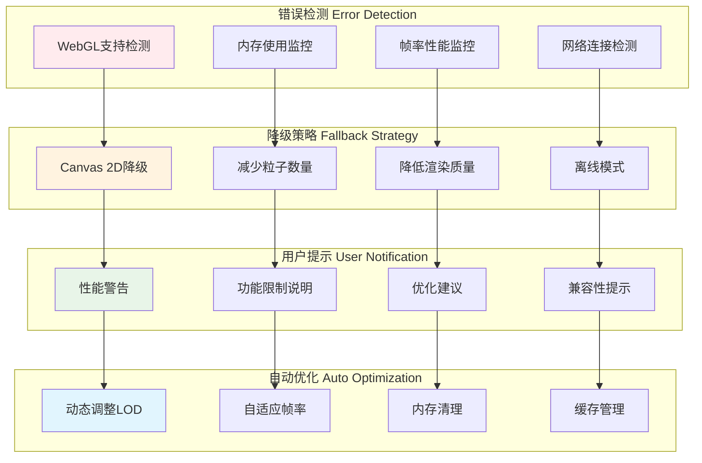

# 交互系统与用户体验设计

## 用户交互流程

```mermaid
flowchart TD
    subgraph "入口层 Entry Level"
        A[应用启动<br/>Application Start]
        B[数据加载<br/>Data Loading]
        C[场景初始化<br/>Scene Initialization]
        D[银河系全景<br/>Galaxy Overview]
    end
    
    subgraph "探索层 Exploration Level"
        E[自由漫游<br/>Free Navigation]
        F[角色搜索<br/>Character Search]
        G[分类筛选<br/>Category Filter]
        H[关系预览<br/>Relationship Preview]
    end
    
    subgraph "聚焦层 Focus Level"
        I[角色选择<br/>Character Selection]
        J[关系网络<br/>Relationship Network]
        K[详情面板<br/>Detail Panel]
        L[相关推荐<br/>Related Suggestions]
    end
    
    subgraph "深度层 Deep Level"
        M[关系分析<br/>Relationship Analysis]
        N[路径追踪<br/>Path Tracing]
        O[事件关联<br/>Event Correlation]
        P[故事脉络<br/>Story Timeline]
    end
    
    A --> B --> C --> D
    D --> E --> F --> G --> H
    H --> I --> J --> K --> L
    L --> M --> N --> O --> P
    
    %% 返回路径
    P -.-> L
    M -.-> J
    I -.-> H
    F -.-> E
    
    style A fill:#e1f5fe
    style E fill:#e8f5e8
    style I fill:#fff3e0
    style M fill:#f3e5f5
```

## 鼠标交互状态机

```mermaid
stateDiagram-v2
    [*] --> Idle : 初始状态
    
    Idle --> Hovering : 鼠标悬浮
    Hovering --> Idle : 鼠标移开
    Hovering --> Clicked : 鼠标点击
    
    Clicked --> Selected : 角色选中
    Selected --> Dragging : 开始拖拽
    Selected --> Clicked : 取消选中
    
    Dragging --> Selected : 结束拖拽
    Dragging --> Idle : 拖拽取消
    
    Selected --> LongPress : 长按开始
    LongPress --> ContextMenu : 显示菜单
    ContextMenu --> Selected : 菜单关闭
    
    Hovering : entry / 高亮角色
    Hovering : do / 显示工具提示
    Hovering : exit / 取消高亮
    
    Selected : entry / 聚焦相机
    Selected : do / 显示关系网络
    Selected : exit / 隐藏关系网络
    
    Dragging : entry / 开始拖拽模式
    Dragging : do / 更新位置
    Dragging : exit / 完成位置更新
```

## 信息层次架构

```mermaid
graph TB
    subgraph "概览层 Overview Layer"
        A[银河系全景<br/>482个角色点]
        B[分类色彩编码<br/>Color Coding]
        C[密度分布<br/>Density Distribution]
        D[主要团体<br/>Major Groups]
    end
    
    subgraph "导航层 Navigation Layer"
        E[搜索框<br/>Search Box]
        F[分类过滤器<br/>Category Filter]
        G[排序选项<br/>Sort Options]
        H[视角控制<br/>View Controls]
    end
    
    subgraph "焦点层 Focus Layer"
        I[角色高亮<br/>Character Highlight]
        J[关系连线<br/>Relationship Lines]
        K[信息气泡<br/>Info Bubble]
        L[相关角色<br/>Related Characters]
    end
    
    subgraph "详情层 Detail Layer"
        M[角色详情面板<br/>Character Detail Panel]
        N[关系列表<br/>Relationship List]
        O[事件时间线<br/>Event Timeline]
        P[引用文献<br/>References]
    end
    
    subgraph "分析层 Analysis Layer"
        Q[关系强度分析<br/>Relationship Strength]
        R[网络中心性<br/>Network Centrality]
        S[路径分析<br/>Path Analysis]
        T[影响力排名<br/>Influence Ranking]
    end
    
    A --> E
    B --> F
    C --> G
    D --> H
    E --> I
    F --> J
    G --> K
    H --> L
    I --> M
    J --> N
    K --> O
    L --> P
    M --> Q
    N --> R
    O --> S
    P --> T
    
    style A fill:#e1f5fe
    style E fill:#e8f5e8
    style I fill:#fff3e0
    style M fill:#f3e5f5
    style Q fill:#fce4ec
```

## 自适应UI系统

```mermaid
graph LR
    subgraph "设备检测 Device Detection"
        A[屏幕尺寸<br/>Screen Size]
        B[设备类型<br/>Device Type]
        C[输入方式<br/>Input Method]
        D[性能等级<br/>Performance Level]
    end
    
    subgraph "布局适配 Layout Adaptation"
        E[桌面布局<br/>Desktop Layout]
        F[平板布局<br/>Tablet Layout]
        G[手机布局<br/>Mobile Layout]
        H[全屏模式<br/>Fullscreen Mode]
    end
    
    subgraph "交互适配 Interaction Adaptation"
        I[鼠标交互<br/>Mouse Interaction]
        J[触摸交互<br/>Touch Interaction]
        K[键盘快捷键<br/>Keyboard Shortcuts]
        L[手势控制<br/>Gesture Control]
    end
    
    subgraph "性能适配 Performance Adaptation"
        M[高质量渲染<br/>High Quality]
        N[中等质量<br/>Medium Quality]
        O[低质量渲染<br/>Low Quality]
        P[最小化模式<br/>Minimal Mode]
    end
    
    A --> E
    A --> F
    A --> G
    B --> H
    C --> I
    C --> J
    C --> K
    C --> L
    D --> M
    D --> N
    D --> O
    D --> P
    
    style A fill:#e8f5e8
    style E fill:#fff3e0
    style I fill:#e1f5fe
    style M fill:#f3e5f5
```

## 实时反馈系统

```mermaid
sequenceDiagram
    participant User as 用户
    participant UI as 用户界面
    participant Engine as 渲染引擎
    participant Data as 数据层
    participant Analytics as 分析引擎
    
    User->>UI: 鼠标悬浮角色
    UI->>Engine: 发起射线检测
    Engine->>UI: 返回碰撞角色
    UI->>Data: 请求角色数据
    Data->>UI: 返回角色信息
    UI->>Analytics: 请求关系分析
    Analytics->>UI: 返回关系数据
    UI->>Engine: 更新视觉效果
    Engine->>User: 显示高亮和信息
    
    User->>UI: 点击角色
    UI->>Engine: 更新相机焦点
    UI->>Data: 获取完整角色数据
    Data->>UI: 返回详细信息
    UI->>Analytics: 计算关系网络
    Analytics->>UI: 返回网络数据
    UI->>Engine: 渲染关系连线
    Engine->>User: 显示详情面板
    
    User->>UI: 拖拽角色
    loop 拖拽过程
        UI->>Engine: 更新角色位置
        Engine->>Analytics: 重计算关系
        Analytics->>Engine: 更新连线
        Engine->>User: 实时视觉反馈
    end
    UI->>Data: 保存位置变更
    Data->>UI: 确认保存完成
```

## 错误处理与降级策略

```mermaid
graph TD
    subgraph "错误检测 Error Detection"
        A[WebGL支持检测]
        B[内存使用监控]
        C[帧率性能监控]
        D[网络连接检测]
    end
    
    subgraph "降级策略 Fallback Strategy"
        E[Canvas 2D降级]
        F[减少粒子数量]
        G[降低渲染质量]
        H[离线模式]
    end
    
    subgraph "用户提示 User Notification"
        I[性能警告]
        J[功能限制说明]
        K[优化建议]
        L[兼容性提示]
    end
    
    subgraph "自动优化 Auto Optimization"
        M[动态调整LOD]
        N[自适应帧率]
        O[内存清理]
        P[缓存管理]
    end
    
    A --> E
    B --> F
    C --> G
    D --> H
    E --> I
    F --> J
    G --> K
    H --> L
    I --> M
    J --> N
    K --> O
    L --> P
    
    style A fill:#ffebee
    style E fill:#fff3e0
    style I fill:#e8f5e8
    style M fill:#e1f5fe
```
