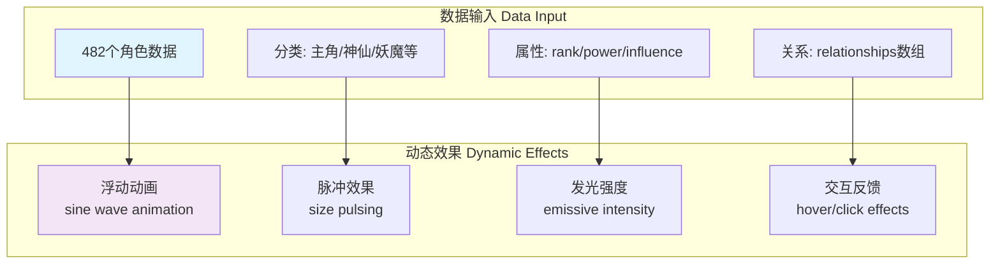
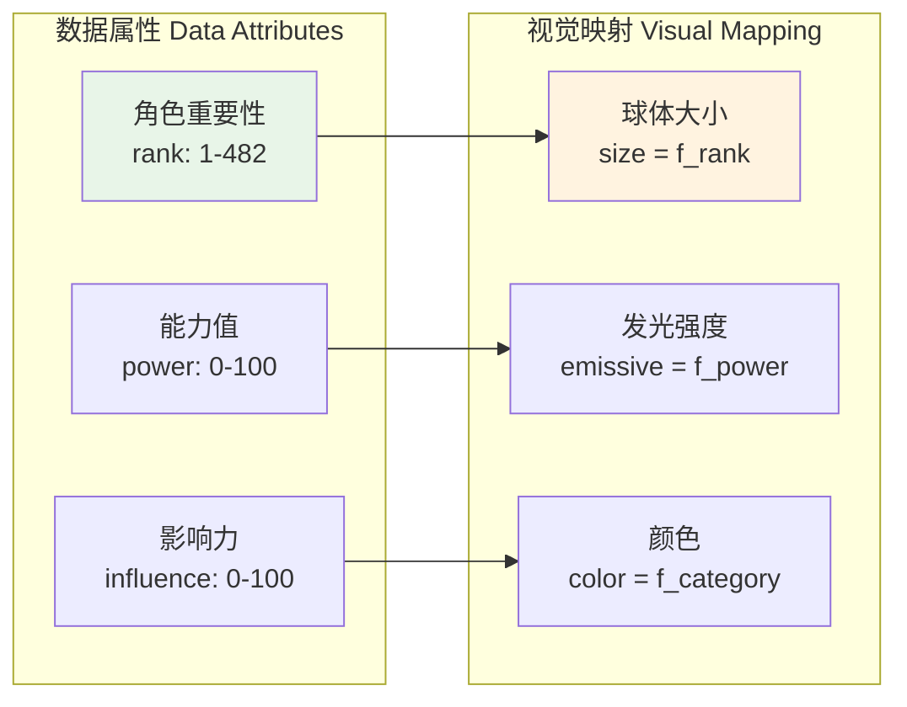
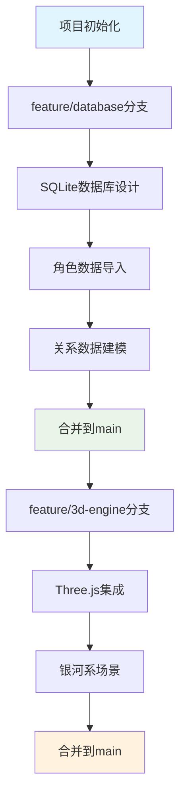

# Mermaid 图表修复验证

## 修复的问题总结

### 1. 数学表达式问题
- **问题**: `sin(time) * amplitude` 和 `f(rank)` 等数学表达式
- **解决**: 替换为文字描述，如 `sine wave animation` 和 `f_rank`

### 2. 特殊字符问题  
- **问题**: `@` 符号在节点名称中引起解析错误
- **解决**: 移除 `@` 符号，使用简化的包名

### 3. Git图表问题
- **问题**: `gitgraph` 语法复杂，容易出错
- **解决**: 改用 `flowchart` 表示开发流程

## 测试示例

### 修复后的角色球体渲染系统

### 修复后的3D可视化数据映射

### 修复后的开发工作流程

## 修复状态
✅ 系统架构图 - 移除特殊字符  
✅ 数据库架构图 - 修复数学表达式  
✅ 3D可视化架构图 - 修复动画描述  
✅ 开发部署流程图 - 替换git图表语法  

所有Mermaid图表现在应该可以正常渲染！
