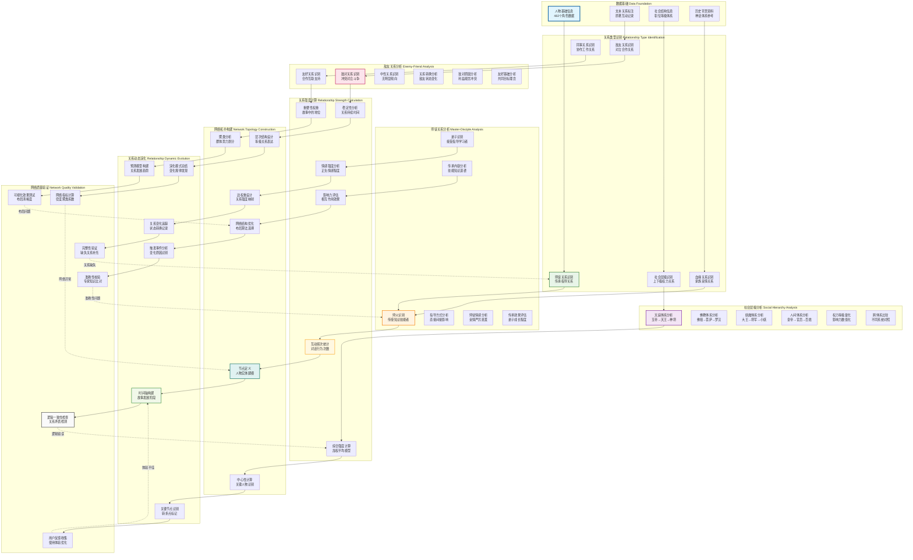
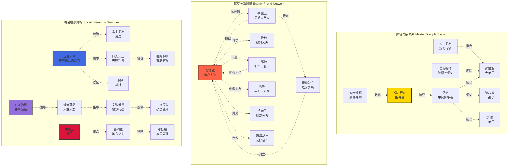
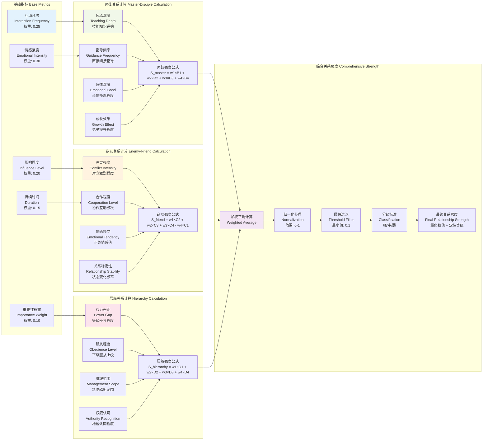
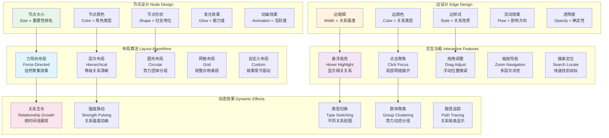
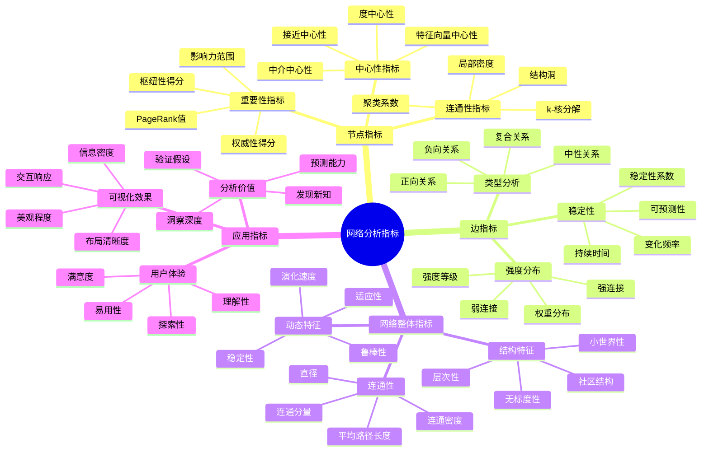

# 西游记人物关系图谱构建与分析流程

## 完整关系网络构建流程

```mermaid
flowchart TD
    subgraph "数据基础 Data Foundation"
        A1[人物基础信息<br/>482个角色数据]
        A2[文本关系标注<br/>原著互动记录]
        A3[社会结构信息<br/>职位等级体系]
        A4[历史背景资料<br/>神话体系参考]
    end
    
    subgraph "关系类型识别 Relationship Type Identification"
        B1[师徒关系识别<br/>传承指导关系]
        B2[敌友关系识别<br/>对立合作关系]
        B3[社会层级识别<br/>上下级权力关系]
        B4[血缘关系识别<br/>家族亲情关系]
        B5[同事关系识别<br/>协作工作关系]
    end
    
    subgraph "师徒关系分析 Master-Disciple Analysis"
        C1[师父识别<br/>传授知识技能者]
        C2[弟子识别<br/>接受指导学习者]
        C3[传承内容分析<br/>技能知识道德]
        C4[指导方式分析<br/>直接间接影响]
        C5[师徒情感分析<br/>亲情严厉慈爱]
        C6[传承效果评估<br/>弟子成长程度]
    end
    
    subgraph "敌友关系分析 Enemy-Friend Analysis"
        D1[敌对关系识别<br/>冲突对立斗争]
        D2[友好关系识别<br/>合作互助支持]
        D3[中性关系识别<br/>无明显倾向]
        D4[关系转换分析<br/>敌友状态变化]
        D5[敌对原因分析<br/>利益观念冲突]
        D6[友好基础分析<br/>共同目标理念]
    end
    
    subgraph "社会层级分析 Social Hierarchy Analysis"
        E1[天庭体系分析<br/>玉帝→天王→神将]
        E2[佛教体系分析<br/>佛祖→菩萨→罗汉]
        E3[妖魔体系分析<br/>大王→将军→小妖]
        E4[人间体系分析<br/>皇帝→官员→百姓]
        E5[权力等级量化<br/>影响力数值化]
        E6[跨体系比较<br/>不同系统对照]
    end
    
    subgraph "关系强度计算 Relationship Strength Calculation"
        F1[互动频次统计<br/>对话行为次数]
        F2[情感强度分析<br/>正负情感程度]
        F3[影响力评估<br/>相互作用效果]
        F4[稳定性分析<br/>关系持续时间]
        F5[重要性权重<br/>故事中的地位]
        F6[综合强度计算<br/>加权平均模型]
    end
    
    subgraph "网络拓扑构建 Network Topology Construction"
        G1[节点定义<br/>人物实体建模]
        G2[边权重设计<br/>关系强度映射]
        G3[网络结构优化<br/>布局算法选择]
        G4[层次结构设计<br/>等级关系表达]
        G5[聚类分析<br/>群体势力划分]
        G6[中心性计算<br/>关键人物识别]
    end
    
    subgraph "关系动态演化 Relationship Dynamic Evolution"
        H1[时间轴构建<br/>故事发展阶段]
        H2[关系变化追踪<br/>状态转换记录]
        H3[触发事件分析<br/>变化原因识别]
        H4[演化模式总结<br/>变化规律发现]
        H5[预测模型构建<br/>关系发展趋势]
        H6[关键节点识别<br/>转折点标记]
    end
    
    subgraph "网络质量验证 Network Quality Validation"
        I1[逻辑一致性检查<br/>关系矛盾检测]
        I2[完整性验证<br/>缺失关系补充]
        I3[准确性校验<br/>专家知识比对]
        I4[网络指标计算<br/>密度聚类系数]
        I5[可视化效果测试<br/>布局清晰度]
        I6[用户反馈收集<br/>使用体验优化]
    end
    
    %% 主流程连接
    A1 --> B1
    A2 --> B2
    A3 --> B3
    A4 --> B4
    
    B1 --> C1
    B2 --> D1
    B3 --> E1
    B4 --> C1
    B5 --> D2
    
    C1 --> F1
    C2 --> F2
    C3 --> F3
    D1 --> F4
    D2 --> F5
    E1 --> F6
    
    F1 --> G1
    F2 --> G2
    F3 --> G3
    F4 --> G4
    F5 --> G5
    F6 --> G6
    
    G1 --> H1
    G2 --> H2
    G3 --> H3
    G4 --> H4
    G5 --> H5
    G6 --> H6
    
    H1 --> I1
    H2 --> I2
    H3 --> I3
    H4 --> I4
    H5 --> I5
    H6 --> I6
    
    %% 优化反馈循环
    I1 -.逻辑错误.-> F6
    I2 -.关系缺失.-> B1
    I3 -.准确性问题.-> C1
    I4 -.网络异常.-> G1
    I5 -.布局问题.-> G3
    I6 -.体验不佳.-> H1
    
    style A1 fill:#e1f5fe,stroke:#01579b,stroke-width:3px
    style B1 fill:#e8f5e8,stroke:#2e7d32,stroke-width:2px
    style C1 fill:#fff3e0,stroke:#f57c00,stroke-width:2px
    style D1 fill:#fce4ec,stroke:#c2185b,stroke-width:2px
    style E1 fill:#f3e5f5,stroke:#7b1fa2,stroke-width:2px
    style F1 fill:#fff8e1,stroke:#f9a825,stroke-width:2px
    style G1 fill:#e0f2f1,stroke:#00695c,stroke-width:2px
    style H1 fill:#f1f8e9,stroke:#388e3c,stroke-width:2px
    style I1 fill:#fafafa,stroke:#424242,stroke-width:2px
```

## 三大关系类型详细分析

```mermaid
graph TB
    subgraph "师徒关系体系 Master-Disciple System"
        A1[观音菩萨<br/>指导者]
        A2[唐僧<br/>中间传承者]
        A3[孙悟空<br/>大弟子]
        A4[猪八戒<br/>二弟子]
        A5[沙僧<br/>三弟子]
        
        A6[菩提祖师<br/>孙悟空师父]
        A7[太上老君<br/>炼丹传承]
        A8[如来佛祖<br/>最高导师]
        
        A1 -.指导.-> A2
        A2 -.师父.-> A3
        A2 -.师父.-> A4
        A2 -.师父.-> A5
        A6 -.传授.-> A3
        A7 -.指点.-> A3
        A8 -.教化.-> A1
    end
    
    subgraph "敌友关系网络 Enemy-Friend Network"
        B1[孙悟空<br/>核心人物]
        B2[牛魔王<br/>兄弟→敌人]
        B3[白骨精<br/>敌对关系]
        B4[二郎神<br/>对手→认可]
        B5[哪吒<br/>敌对→友好]
        
        B6[镇元子<br/>朋友关系]
        B7[东海龙王<br/>友好合作]
        B8[铁扇公主<br/>敌对关系]
        
        B1 -.兄弟情.-> B2
        B2 -.翻脸.-> B1
        B1 -.斗争.-> B3
        B1 -.较量.-> B4
        B4 -.惺惺相惜.-> B1
        B1 -.化敌为友.-> B5
        B1 -.结交.-> B6
        B1 -.合作.-> B7
        B2 -.夫妻.-> B8
        B8 -.对立.-> B1
    end
    
    subgraph "社会层级结构 Social Hierarchy Structure"
        C1[玉皇大帝<br/>天庭最高统治者]
        C2[太上老君<br/>三清之一]
        C3[四大天王<br/>天庭将领]
        C4[二郎神<br/>战神]
        C5[各路神仙<br/>天庭官员]
        
        C6[如来佛祖<br/>佛教领袖]
        C7[观音菩萨<br/>大慈大悲]
        C8[文殊普贤<br/>智慧行愿]
        C9[十八罗汉<br/>护法金刚]
        
        C10[牛魔王<br/>妖王]
        C11[各洞主<br/>地方势力]
        C12[小妖精<br/>底层妖怪]
        
        C1 -.统治.-> C2
        C1 -.统率.-> C3
        C1 -.指挥.-> C4
        C3 -.管理.-> C5
        
        C6 -.领导.-> C7
        C7 -.指导.-> C8
        C8 -.统领.-> C9
        
        C10 -.统治.-> C11
        C11 -.管辖.-> C12
    end
    
    style A1 fill:#FFD700,stroke:#333,stroke-width:2px
    style B1 fill:#FF6347,stroke:#333,stroke-width:2px
    style C1 fill:#4169E1,stroke:#333,stroke-width:2px
    style C6 fill:#9370DB,stroke:#333,stroke-width:2px
    style C10 fill:#DC143C,stroke:#333,stroke-width:2px
```

## 关系强度计算模型

```mermaid
graph LR
    subgraph "基础指标 Base Metrics"
        A1[互动频次<br/>Interaction Frequency<br/>权重: 0.25]
        A2[情感强度<br/>Emotional Intensity<br/>权重: 0.30]
        A3[影响程度<br/>Influence Level<br/>权重: 0.20]
        A4[持续时间<br/>Duration<br/>权重: 0.15]
        A5[重要性权重<br/>Importance Weight<br/>权重: 0.10]
    end
    
    subgraph "师徒关系计算 Master-Disciple Calculation"
        B1[传承深度<br/>Teaching Depth<br/>技能知识道德]
        B2[指导频率<br/>Guidance Frequency<br/>直接间接指导]
        B3[感情深度<br/>Emotional Bond<br/>亲情师恩程度]
        B4[成长效果<br/>Growth Effect<br/>弟子提升程度]
        
        B5[师徒强度公式<br/>S_master = w1×B1 + w2×B2 + w3×B3 + w4×B4]
    end
    
    subgraph "敌友关系计算 Enemy-Friend Calculation"
        C1[冲突强度<br/>Conflict Intensity<br/>对立激烈程度]
        C2[合作程度<br/>Cooperation Level<br/>协作互助频次]
        C3[情感倾向<br/>Emotional Tendency<br/>正负情感值]
        C4[关系稳定性<br/>Relationship Stability<br/>状态变化频率]
        
        C5[敌友强度公式<br/>S_friend = w1×C2 + w2×C3 + w3×C4 - w4×C1]
    end
    
    subgraph "层级关系计算 Hierarchy Calculation"
        D1[权力差距<br/>Power Gap<br/>等级差异程度]
        D2[服从程度<br/>Obedience Level<br/>下级服从上级]
        D3[管理范围<br/>Management Scope<br/>影响辐射范围]
        D4[权威认可<br/>Authority Recognition<br/>地位认同程度]
        
        D5[层级强度公式<br/>S_hierarchy = w1×D1 + w2×D2 + w3×D3 + w4×D4]
    end
    
    subgraph "综合关系强度 Comprehensive Strength"
        E1[加权平均计算<br/>Weighted Average]
        E2[归一化处理<br/>Normalization<br/>范围: 0-1]
        E3[阈值过滤<br/>Threshold Filter<br/>最小值: 0.1]
        E4[分级标准<br/>Classification<br/>强/中/弱]
        
        E5[最终关系强度<br/>Final Relationship Strength<br/>量化数值 + 定性等级]
    end
    
    A1 --> B1
    A2 --> B2
    A3 --> C1
    A4 --> C2
    A5 --> D1
    
    B1 --> B5
    B2 --> B5
    B3 --> B5
    B4 --> B5
    
    C1 --> C5
    C2 --> C5
    C3 --> C5
    C4 --> C5
    
    D1 --> D5
    D2 --> D5
    D3 --> D5
    D4 --> D5
    
    B5 --> E1
    C5 --> E1
    D5 --> E1
    
    E1 --> E2 --> E3 --> E4 --> E5
    
    style A1 fill:#e3f2fd
    style B1 fill:#f1f8e9
    style C1 fill:#fff3e0
    style D1 fill:#fce4ec
    style E1 fill:#f3e5f5
```

## 网络拓扑与可视化策略

```mermaid
graph TD
    subgraph "节点设计 Node Design"
        A1[节点大小<br/>Size ∝ 重要性排名]
        A2[节点颜色<br/>Color = 角色类型]
        A3[节点形状<br/>Shape = 社会地位]
        A4[发光效果<br/>Glow = 能力值]
        A5[动画效果<br/>Animation = 活跃度]
    end
    
    subgraph "边设计 Edge Design"
        B1[边粗细<br/>Width ∝ 关系强度]
        B2[边颜色<br/>Color = 关系类型]
        B3[边样式<br/>Style = 关系性质]
        B4[流动效果<br/>Flow = 影响方向]
        B5[透明度<br/>Opacity = 确定性]
    end
    
    subgraph "布局算法 Layout Algorithms"
        C1[力导向布局<br/>Force-Directed<br/>自然聚集效果]
        C2[层次布局<br/>Hierarchical<br/>等级关系清晰]
        C3[圆形布局<br/>Circular<br/>势力团体分组]
        C4[网格布局<br/>Grid<br/>规整对称美观]
        C5[自定义布局<br/>Custom<br/>故事情节驱动]
    end
    
    subgraph "交互功能 Interactive Features"
        D1[悬浮高亮<br/>Hover Highlight<br/>显示相关关系]
        D2[点击聚焦<br/>Click Focus<br/>局部网络展开]
        D3[拖拽调整<br/>Drag Adjust<br/>手动位置微调]
        D4[缩放导航<br/>Zoom Navigation<br/>多层次浏览]
        D5[搜索定位<br/>Search Locate<br/>快速找到目标]
    end
    
    subgraph "动态效果 Dynamic Effects"
        E1[关系生长<br/>Relationship Growth<br/>按时间线展现]
        E2[强度脉动<br/>Strength Pulsing<br/>关系强度动画]
        E3[类型切换<br/>Type Switching<br/>不同关系视图]
        E4[群体聚类<br/>Group Clustering<br/>势力动态分组]
        E5[路径追踪<br/>Path Tracing<br/>关系链条显示]
    end
    
    A1 --> C1
    A2 --> C2
    A3 --> C3
    B1 --> D1
    B2 --> D2
    B3 --> D3
    C1 --> E1
    C2 --> E2
    D1 --> E3
    D2 --> E4
    
    style A1 fill:#e8f5e8
    style B1 fill:#fff3e0
    style C1 fill:#e1f5fe
    style D1 fill:#f3e5f5
    style E1 fill:#fce4ec
```

## 网络分析指标体系

```mermaid
mindmap
  root((网络分析指标))
    节点指标
      中心性指标
        度中心性
        接近中心性
        中介中心性
        特征向量中心性
      重要性指标
        PageRank值
        权威性得分
        枢纽性得分
        影响力范围
      连通性指标
        聚类系数
        局部密度
        k-核分解
        结构洞
    
    边指标
      强度分布
        强连接
        弱连接
        权重分布
        强度等级
      类型分析
        正向关系
        负向关系
        中性关系
        复合关系
      稳定性
        持续时间
        变化频率
        稳定性系数
        可预测性
    
    网络整体指标
      连通性
        连通分量
        直径
        平均路径长度
        连通密度
      结构特征
        小世界性
        无标度性
        社区结构
        层次性
      动态特征
        演化速度
        稳定性
        鲁棒性
        适应性
    
    应用指标
      可视化效果
        布局清晰度
        信息密度
        美观程度
        交互响应
      分析价值
        洞察深度
        发现新知
        验证假设
        预测能力
      用户体验
        易用性
        理解性
        探索性
        满意度
```
