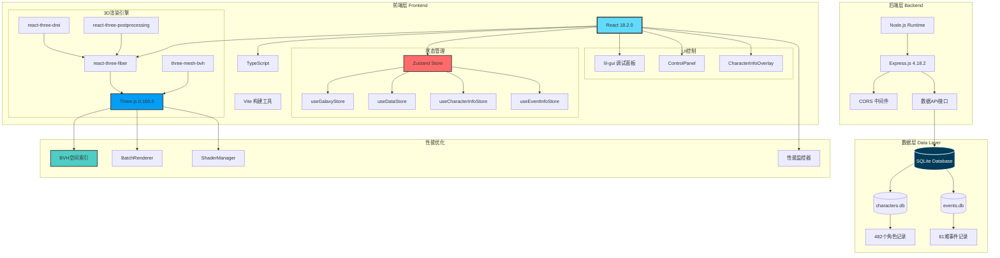
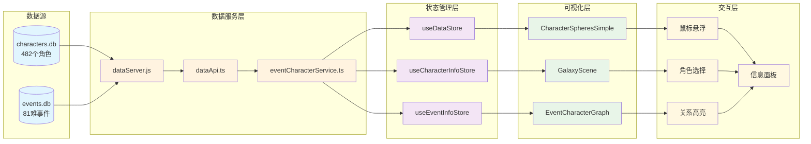
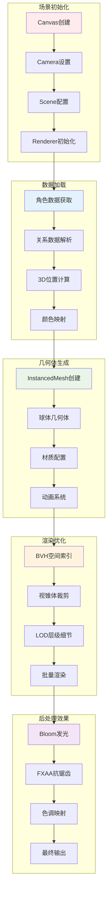

# 西游记人物关系图谱系统架构图

## 整体系统架构

```mermaid
graph TB
    subgraph "前端层 Frontend"
        A[React 18.2.0]
        B[TypeScript]
        C[Vite 构建工具]
        
        subgraph "3D渲染引擎"
            D[Three.js 0.160.0]
            E[react-three-fiber]
            F[react-three-drei]
            G[react-three-postprocessing]
            H[three-mesh-bvh]
        end
        
        subgraph "状态管理"
            I[Zustand Store]
            J[useGalaxyStore]
            K[useDataStore]
            L[useCharacterInfoStore]
            M[useEventInfoStore]
        end
        
        subgraph "UI控制"
            N[lil-gui 调试面板]
            O[ControlPanel]
            P[CharacterInfoOverlay]
        end
    end
    
    subgraph "后端层 Backend"
        Q[Express.js 4.18.2]
        R[Node.js Runtime]
        S[CORS 中间件]
        T[数据API接口]
    end
    
    subgraph "数据层 Data Layer"
        U[(SQLite Database)]
        V[(characters.db)]
        W[(events.db)]
        X[482个角色记录]
        Y[81难事件记录]
    end
    
    subgraph "性能优化"
        Z[BVH空间索引]
        AA[BatchRenderer]
        BB[ShaderManager]
        CC[性能监控器]
    end
    
    A --> B
    A --> I
    A --> E
    E --> D
    F --> E
    G --> E
    H --> D
    I --> J
    I --> K
    I --> L
    I --> M
    A --> N
    A --> O
    A --> P
    R --> Q
    Q --> S
    Q --> T
    T --> U
    U --> V
    U --> W
    V --> X
    W --> Y
    D --> Z
    D --> AA
    D --> BB
    A --> CC
    
    style A fill:#61dafb,stroke:#333,stroke-width:3px
    style D fill:#049ef4,stroke:#333,stroke-width:2px
    style I fill:#ff6b6b,stroke:#333,stroke-width:2px
    style U fill:#003b57,stroke:#fff,stroke-width:2px,color:#fff
    style Z fill:#4ecdc4,stroke:#333,stroke-width:2px
```

## 数据流架构

```mermaid
flowchart LR
    subgraph "数据源"
        A[(characters.db<br/>482个角色)]
        B[(events.db<br/>81难事件)]
    end
    
    subgraph "数据服务层"
        C[dataServer.js]
        D[dataApi.ts]
        E[eventCharacterService.ts]
    end
    
    subgraph "状态管理层"
        F[useDataStore]
        G[useCharacterInfoStore]
        H[useEventInfoStore]
    end
    
    subgraph "可视化层"
        I[CharacterSpheresSimple]
        J[GalaxyScene]
        K[EventCharacterGraph]
    end
    
    subgraph "交互层"
        L[鼠标悬浮]
        M[角色选择]
        N[关系高亮]
        O[信息面板]
    end
    
    A --> C
    B --> C
    C --> D
    D --> E
    E --> F
    E --> G
    E --> H
    F --> I
    G --> J
    H --> K
    I --> L
    J --> M
    K --> N
    L --> O
    M --> O
    N --> O
    
    style A fill:#e1f5fe
    style B fill:#e1f5fe
    style C fill:#fff3e0
    style D fill:#fff3e0
    style E fill:#fff3e0
    style F fill:#f3e5f5
    style G fill:#f3e5f5
    style H fill:#f3e5f5
    style I fill:#e8f5e8
    style J fill:#e8f5e8
    style K fill:#e8f5e8
    style L fill:#fff8e1
    style M fill:#fff8e1
    style N fill:#fff8e1
    style O fill:#fff8e1
```

## 3D渲染管线

```mermaid
graph TD
    subgraph "场景初始化"
        A[Canvas创建]
        B[Camera设置]
        C[Scene配置]
        D[Renderer初始化]
    end
    
    subgraph "数据加载"
        E[角色数据获取]
        F[关系数据解析]
        G[3D位置计算]
        H[颜色映射]
    end
    
    subgraph "几何体生成"
        I[InstancedMesh创建]
        J[球体几何体]
        K[材质配置]
        L[动画系统]
    end
    
    subgraph "渲染优化"
        M[BVH空间索引]
        N[视锥体裁剪]
        O[LOD层级细节]
        P[批量渲染]
    end
    
    subgraph "后处理效果"
        Q[Bloom发光]
        R[FXAA抗锯齿]
        S[色调映射]
        T[最终输出]
    end
    
    A --> B --> C --> D
    D --> E --> F --> G --> H
    H --> I --> J --> K --> L
    L --> M --> N --> O --> P
    P --> Q --> R --> S --> T
    
    style A fill:#ffebee
    style E fill:#e3f2fd
    style I fill:#e8f5e8
    style M fill:#fff3e0
    style Q fill:#f3e5f5
```
