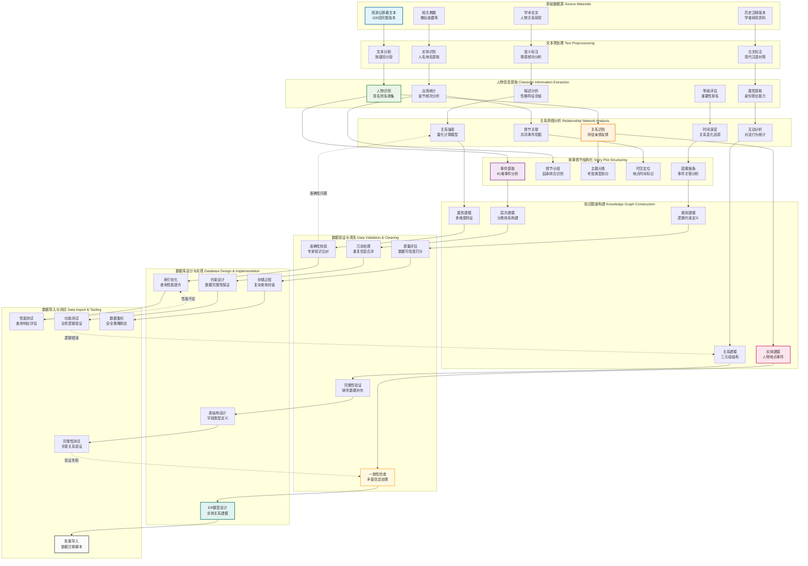
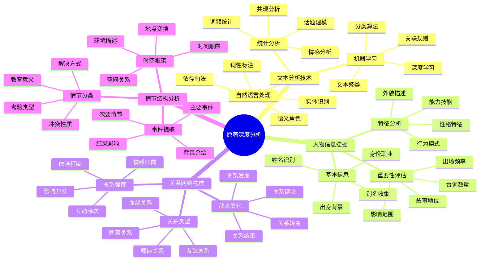
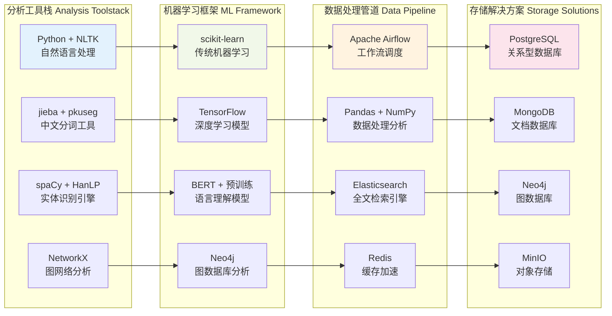
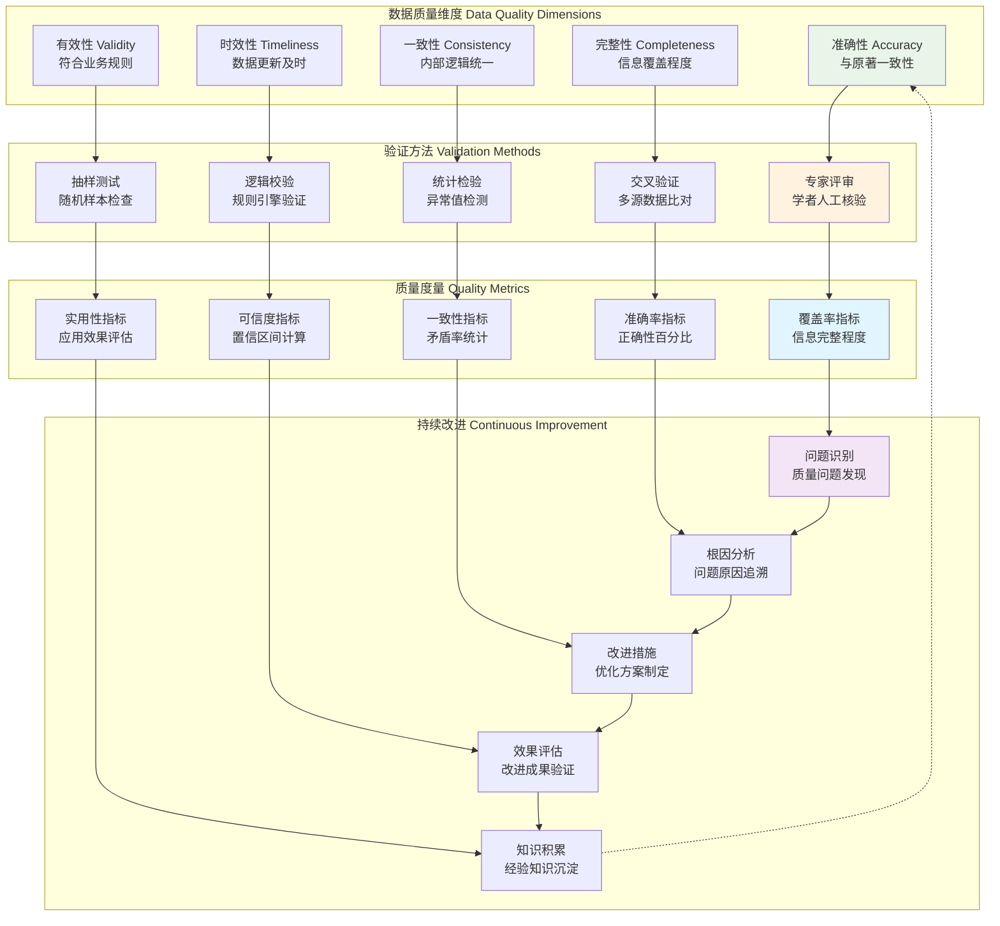

# 西游记原著文本深度分析与数据库构建流程

## 完整分析流程图

```mermaid
flowchart TD
    subgraph "原始数据源 Source Materials"
        A1[西游记原著文本<br/>100回完整版本]
        A2[历史注释版本<br/>学者研究资料]
        A3[相关典籍<br/>佛经道藏等]
        A4[学术论文<br/>人物关系研究]
    end
    
    subgraph "文本预处理 Text Preprocessing"
        B1[文本分割<br/>按章回分段]
        B2[古文标注<br/>现代汉语对照]
        B3[实体识别<br/>人名地名提取]
        B4[语义标注<br/>情感倾向分析]
    end
    
    subgraph "人物信息提取 Character Information Extraction"
        C1[人物识别<br/>姓名别名收集]
        C2[属性提取<br/>身份职业能力]
        C3[出场统计<br/>章节频次分析]
        C4[描述分析<br/>性格特征总结]
        C5[等级评估<br/>重要性排名]
    end
    
    subgraph "关系网络分析 Relationship Network Analysis"
        D1[关系识别<br/>师徒亲情友情]
        D2[互动分析<br/>对话行为统计]
        D3[情节关联<br/>共同事件挖掘]
        D4[关系强度<br/>量化计算模型]
        D5[时间演变<br/>关系变化追踪]
    end
    
    subgraph "故事情节结构化 Story Plot Structuring"
        E1[事件提取<br/>81难事件分析]
        E2[情节分段<br/>起承转合识别]
        E3[主题分类<br/>考验类型划分]
        E4[时空定位<br/>地点时间标记]
        E5[因果链条<br/>事件关联分析]
    end
    
    subgraph "知识图谱构建 Knowledge Graph Construction"
        F1[实体建模<br/>人物地点事件]
        F2[关系建模<br/>三元组结构]
        F3[属性建模<br/>多维度特征]
        F4[层次建模<br/>分类体系构建]
        F5[规则建模<br/>逻辑约束定义]
    end
    
    subgraph "数据验证与清洗 Data Validation & Cleaning"
        G1[一致性检查<br/>矛盾信息处理]
        G2[完整性验证<br/>缺失数据补充]
        G3[准确性校验<br/>专家知识比对]
        G4[冗余处理<br/>重复信息合并]
        G5[质量评估<br/>数据可信度打分]
    end
    
    subgraph "数据库设计与实现 Database Design & Implementation"
        H1[ER模型设计<br/>实体关系建模]
        H2[表结构设计<br/>字段类型定义]
        H3[索引优化<br/>查询性能提升]
        H4[约束设计<br/>数据完整性保证]
        H5[存储过程<br/>复杂查询封装]
    end
    
    subgraph "数据导入与测试 Data Import & Testing"
        I1[批量导入<br/>数据迁移脚本]
        I2[完整性测试<br/>关联关系验证]
        I3[性能测试<br/>查询响应评估]
        I4[功能测试<br/>业务逻辑验证]
        I5[数据备份<br/>安全策略制定]
    end
    
    %% 主流程连接
    A1 --> B1
    A2 --> B2
    A3 --> B3
    A4 --> B4
    
    B1 --> C1
    B2 --> C2
    B3 --> C3
    B4 --> C4
    
    C1 --> D1
    C2 --> D2
    C3 --> D3
    C4 --> D4
    C5 --> D5
    
    C1 --> E1
    C3 --> E2
    D1 --> E3
    D3 --> E4
    D5 --> E5
    
    D1 --> F1
    D2 --> F2
    D4 --> F3
    E1 --> F4
    E5 --> F5
    
    F1 --> G1
    F2 --> G2
    F3 --> G3
    F4 --> G4
    F5 --> G5
    
    G1 --> H1
    G2 --> H2
    G3 --> H3
    G4 --> H4
    G5 --> H5
    
    H1 --> I1
    H2 --> I2
    H3 --> I3
    H4 --> I4
    H5 --> I5
    
    %% 反馈循环
    I2 -.验证失败.-> G1
    I3 -.性能不足.-> H3
    I4 -.逻辑错误.-> F2
    G3 -.准确性问题.-> D4
    
    style A1 fill:#e1f5fe,stroke:#01579b,stroke-width:2px
    style C1 fill:#e8f5e8,stroke:#2e7d32,stroke-width:2px
    style D1 fill:#fff3e0,stroke:#f57c00,stroke-width:2px
    style E1 fill:#f3e5f5,stroke:#7b1fa2,stroke-width:2px
    style F1 fill:#fce4ec,stroke:#c2185b,stroke-width:2px
    style G1 fill:#fff8e1,stroke:#f9a825,stroke-width:2px
    style H1 fill:#e0f2f1,stroke:#00695c,stroke-width:2px
    style I1 fill:#fafafa,stroke:#424242,stroke-width:2px
```

## 详细分析方法论

```mermaid
mindmap
  root((原著深度分析))
    文本分析技术
      自然语言处理
        词性标注
        实体识别
        依存句法
        语义角色
      统计分析
        词频统计
        共现分析
        情感分析
        话题建模
      机器学习
        文本聚类
        分类算法
        关联规则
        深度学习
    
    人物信息挖掘
      基本信息
        姓名识别
        别名收集
        身份职业
        出身背景
      特征分析
        性格特征
        能力技能
        外貌描述
        行为模式
      重要性评估
        出场频率
        台词数量
        影响范围
        故事地位
    
    关系网络构建
      关系类型
        师徒关系
        血缘关系
        友敌关系
        同事关系
      关系强度
        互动频次
        情感倾向
        依赖程度
        影响力度
      动态变化
        关系建立
        关系发展
        关系转变
        关系结束
    
    情节结构分析
      事件提取
        主要事件
        次要情节
        背景介绍
        结果影响
      情节分类
        考验类型
        冲突性质
        解决方式
        教育意义
      时空框架
        时间顺序
        地点变换
        空间关系
        环境描述
```

## 技术实现架构

```mermaid
graph LR
    subgraph "分析工具栈 Analysis Toolstack"
        A[Python + NLTK<br/>自然语言处理]
        B[jieba + pkuseg<br/>中文分词工具]
        C[spaCy + HanLP<br/>实体识别引擎]
        D[NetworkX<br/>图网络分析]
    end
    
    subgraph "机器学习框架 ML Framework"
        E[scikit-learn<br/>传统机器学习]
        F[TensorFlow<br/>深度学习模型]
        G[BERT + 预训练<br/>语言理解模型]
        H[Neo4j<br/>图数据库分析]
    end
    
    subgraph "数据处理管道 Data Pipeline"
        I[Apache Airflow<br/>工作流调度]
        J[Pandas + NumPy<br/>数据处理分析]
        K[Elasticsearch<br/>全文检索引擎]
        L[Redis<br/>缓存加速]
    end
    
    subgraph "存储解决方案 Storage Solutions"
        M[PostgreSQL<br/>关系型数据库]
        N[MongoDB<br/>文档数据库]
        O[Neo4j<br/>图数据库]
        P[MinIO<br/>对象存储]
    end
    
    A --> E
    B --> F
    C --> G
    D --> H
    E --> I
    F --> J
    G --> K
    H --> L
    I --> M
    J --> N
    K --> O
    L --> P
    
    style A fill:#e3f2fd
    style E fill:#f1f8e9
    style I fill:#fff3e0
    style M fill:#fce4ec
```

## 质量控制体系

```mermaid
graph TD
    subgraph "数据质量维度 Data Quality Dimensions"
        A1[准确性 Accuracy<br/>与原著一致性]
        A2[完整性 Completeness<br/>信息覆盖程度]
        A3[一致性 Consistency<br/>内部逻辑统一]
        A4[时效性 Timeliness<br/>数据更新及时]
        A5[有效性 Validity<br/>符合业务规则]
    end
    
    subgraph "验证方法 Validation Methods"
        B1[专家评审<br/>学者人工核验]
        B2[交叉验证<br/>多源数据比对]
        B3[统计检验<br/>异常值检测]
        B4[逻辑校验<br/>规则引擎验证]
        B5[抽样测试<br/>随机样本检查]
    end
    
    subgraph "质量度量 Quality Metrics"
        C1[覆盖率指标<br/>信息完整程度]
        C2[准确率指标<br/>正确性百分比]
        C3[一致性指标<br/>矛盾率统计]
        C4[可信度指标<br/>置信区间计算]
        C5[实用性指标<br/>应用效果评估]
    end
    
    subgraph "持续改进 Continuous Improvement"
        D1[问题识别<br/>质量问题发现]
        D2[根因分析<br/>问题原因追溯]
        D3[改进措施<br/>优化方案制定]
        D4[效果评估<br/>改进成果验证]
        D5[知识积累<br/>经验知识沉淀]
    end
    
    A1 --> B1 --> C1 --> D1
    A2 --> B2 --> C2 --> D2
    A3 --> B3 --> C3 --> D3
    A4 --> B4 --> C4 --> D4
    A5 --> B5 --> C5 --> D5
    
    D1 --> D2 --> D3 --> D4 --> D5
    D5 -.-> A1
    
    style A1 fill:#e8f5e8
    style B1 fill:#fff3e0
    style C1 fill:#e1f5fe
    style D1 fill:#f3e5f5
```
