# 西游记关系图谱 3D 可视化项目 - 技术架构图

##  整体技术架构图

```mermaid
graph TB
    subgraph Frontend["前端层 Frontend Layer"]
        A[React 18.2.0]
        B[TypeScript 5.2.2]
        C[Vite 5.0.8]
        
        subgraph Engine["3D渲染引擎"]
            D[Three.js 0.160.0]
            E[react-three-fiber 8.15.0]
            F[react-three-drei 9.92.0]
            G[react-three-postprocessing 2.15.0]
            H[three-mesh-bvh 0.9.1]
        end
        
        subgraph State["状态管理"]
            I[Zustand 4.4.7]
            J[useGalaxyStore]
            K[useDataStore]
            L[useCharacterInfoStore]
            M[useEventInfoStore]
            N[useModelEffectStore]
        end
        
        subgraph UI["UI工具"]
            CC[lil-gui 0.19.1]
            DD[CSS3]
        end
    end
    
    subgraph Backend["后端层 Backend Layer"]
        O[Node.js Runtime]
        P[Express.js 4.18.2]
        Q[CORS 2.8.5]
    end
    
    subgraph Database["数据层 Data Layer"]
        S[SQLite Database]
        T[better-sqlite3 11.10.0]
        U[characters.db]
        V[482条记录]
    end
    
    subgraph Performance["性能优化层"]
        W[BVH空间优化]
        X[BatchRenderer]
        Y[ShaderManager]
        Z[PerformanceProfiler]
        AA[BVHProfiler]
    end
    
    subgraph Tools["开发工具层"]
        BB[ESLint 8.55.0]
        EE[热重载开发]
    end
    
    A --> B
    A --> I
    A --> E
    E --> D
    F --> E
    G --> E
    H --> D
    I --> J
    I --> K
    I --> L
    I --> M
    I --> N
    O --> P
    P --> Q
    T --> S
    S --> U
    U --> V
    W --> H
    X --> D
    Y --> D
    Z --> A
    AA --> W
    BB --> B
    EE --> C
    CC --> A
    A -.-> O
    P --> T
    K --> S
    D --> W
    
    style A fill:#61dafb
    style D fill:#049ef4
    style I fill:#ff6b6b
    style S fill:#003b57
    style W fill:#4ecdc4
```

##  核心功能模块架构图

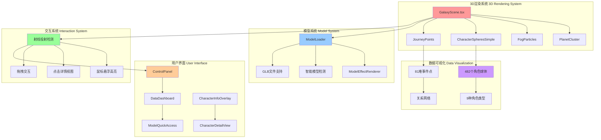

##  Hooks架构依赖图

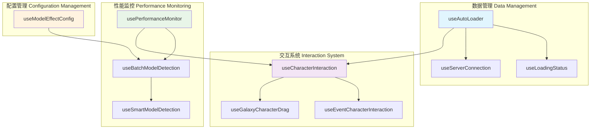

##  数据流架构图

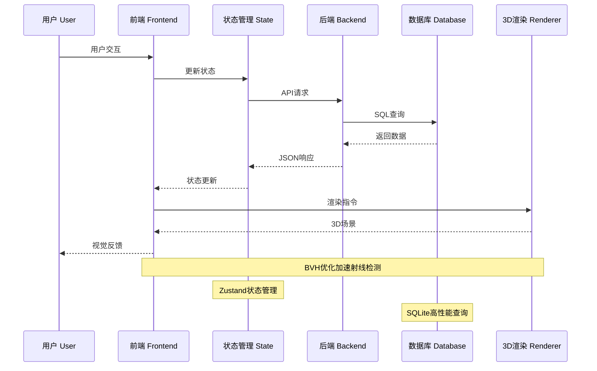

##  性能优化架构图

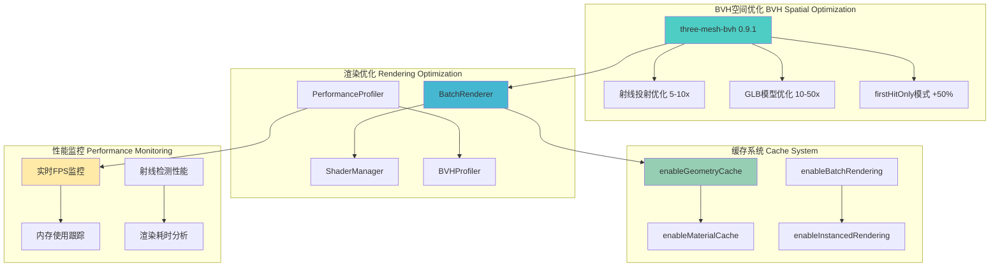

##  依赖关系图

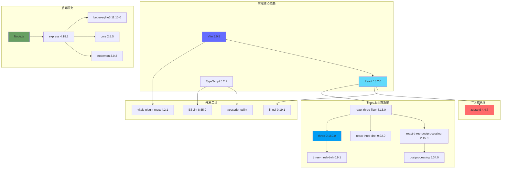

##  部署架构图

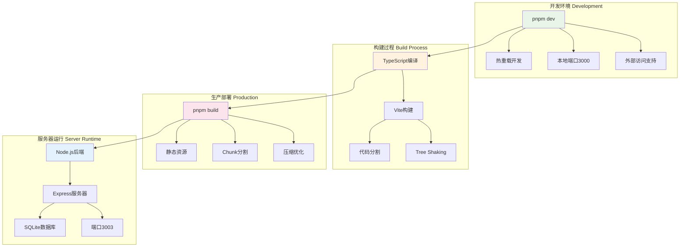

##  项目规模可视化

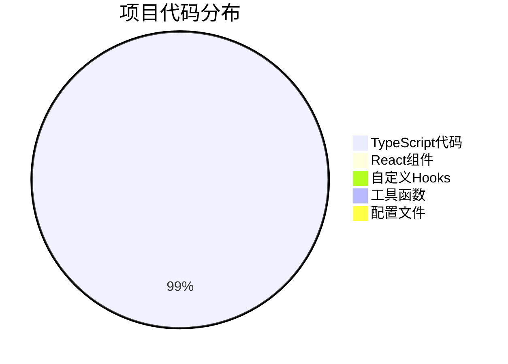

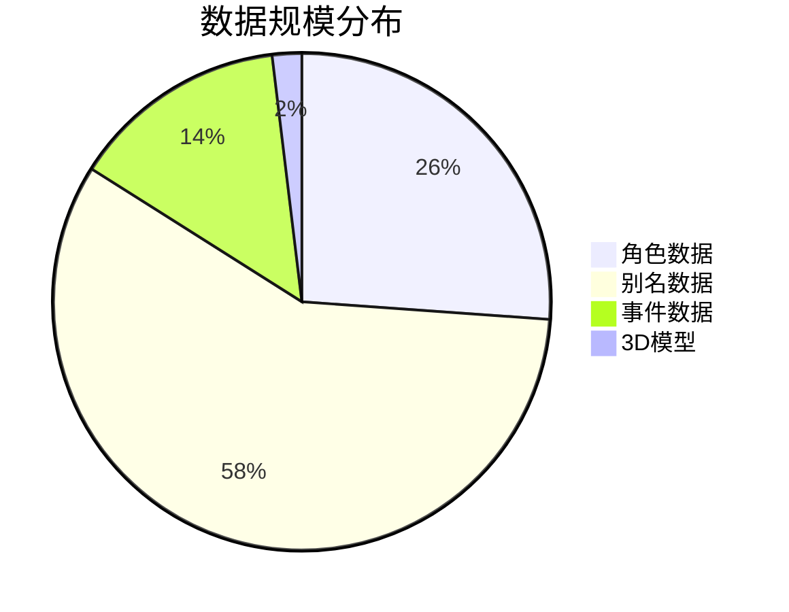

##  技术特色雷达图

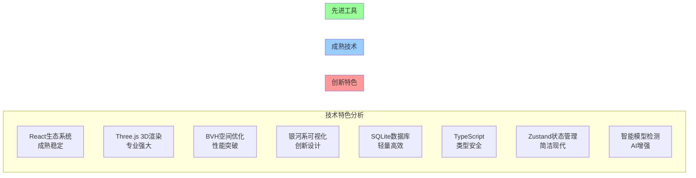

##  技术演进时间线

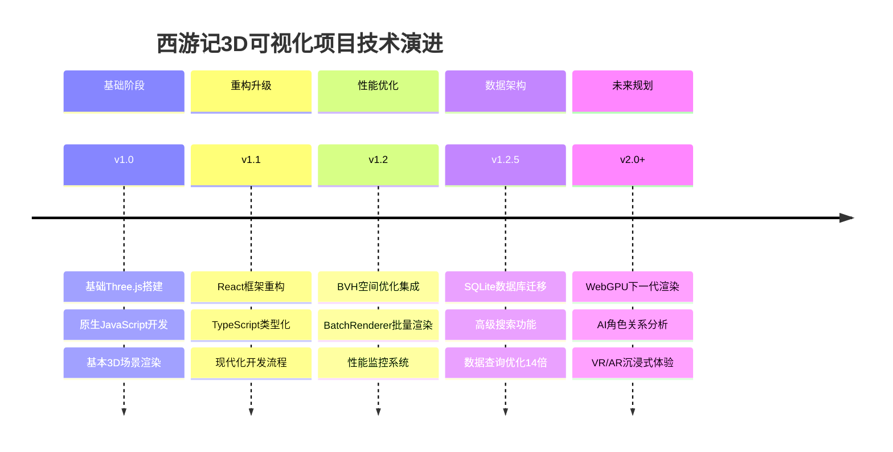

##  技术栈演进图表

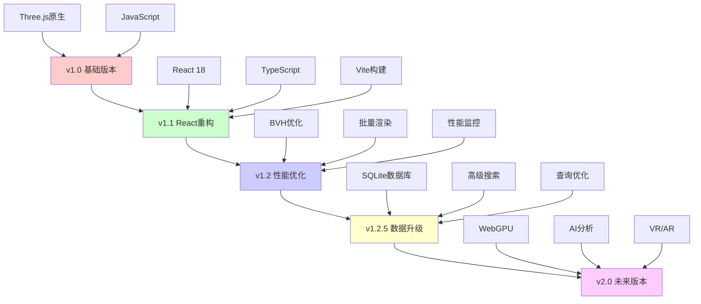

---

*架构图生成时间: 2025年6月30日*  
*基于项目版本: v1.2.5*  
*技术栈架构: 完整可视化版本*
