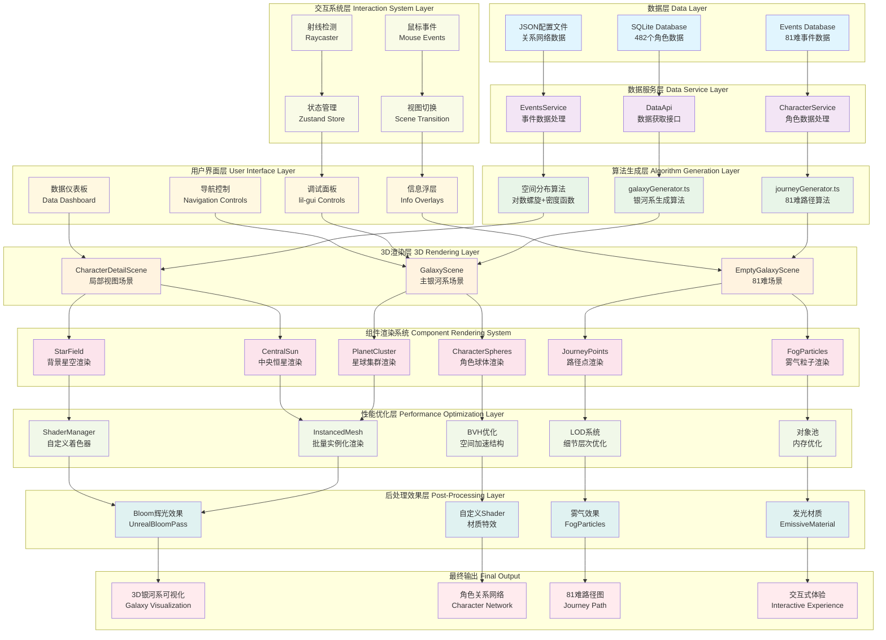
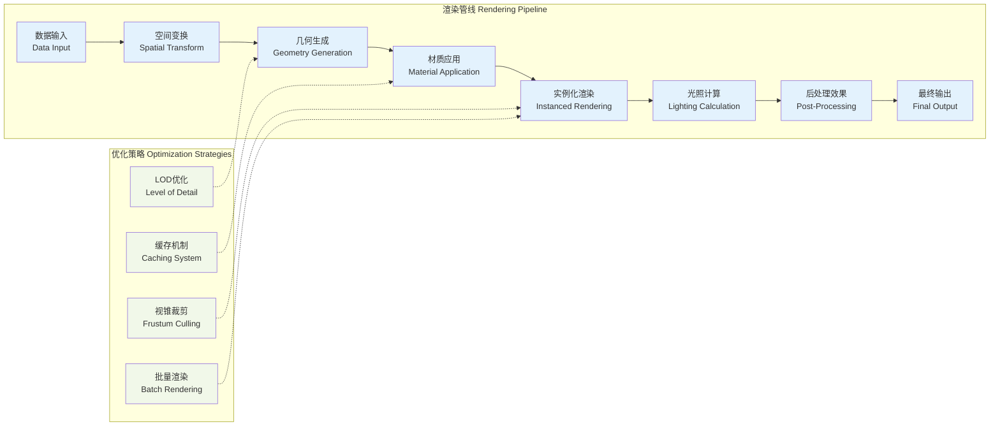
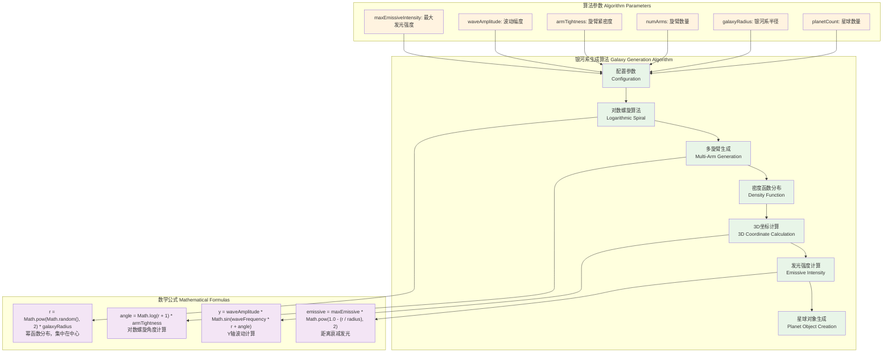
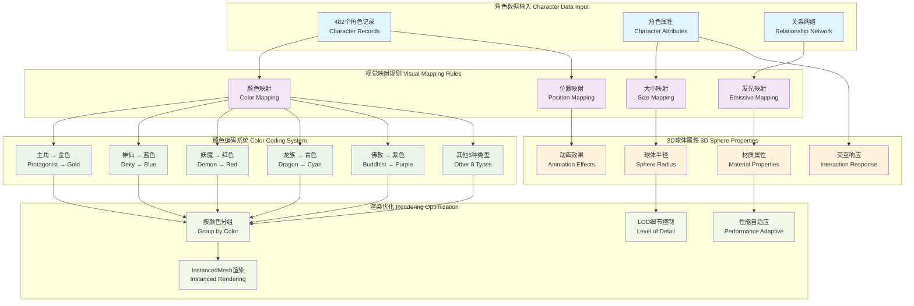
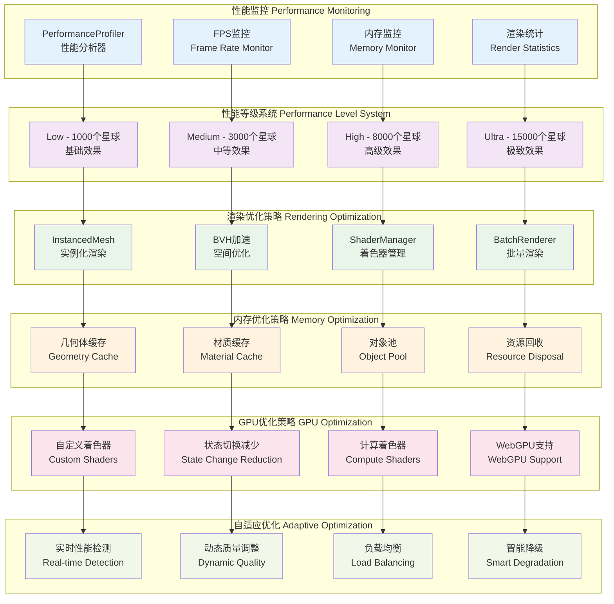
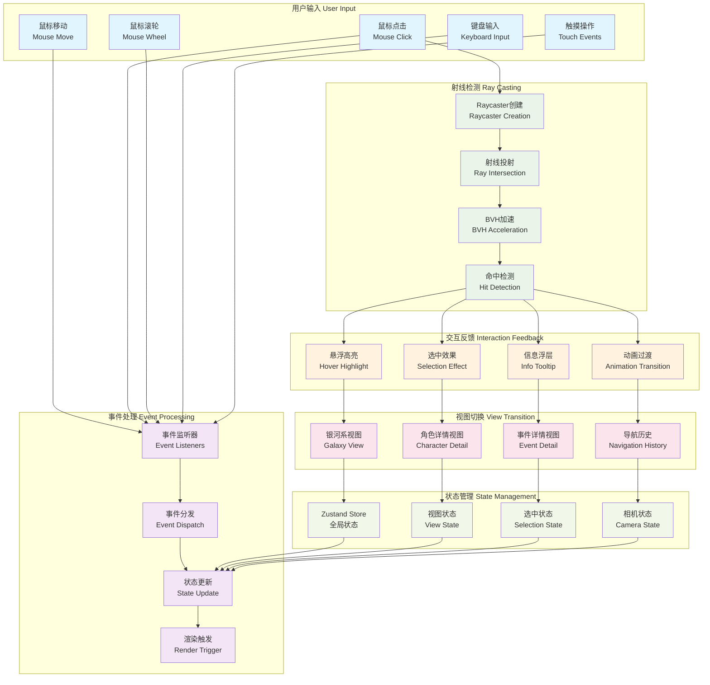
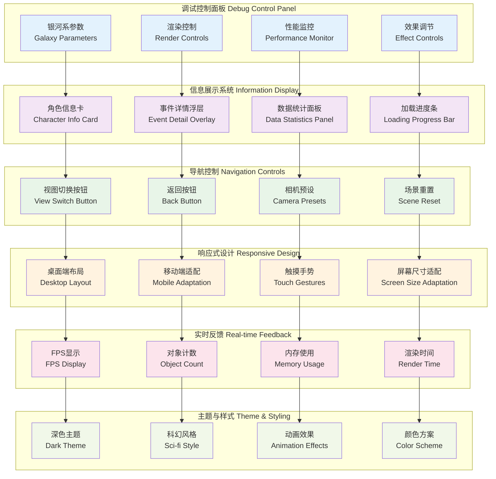

# 西游记关系图谱 3D 可视化呈现架构图

## 📊 整体可视化架构流程图

## 🎨 可视化渲染管线详细流程

## 🌌 银河系生成算法可视化

## 🎭 角色可视化映射策略

## ⚡ 性能优化架构图

## 🎮 交互系统架构图

## 📱 用户界面架构图

---

## 📝 总结

这套可视化架构图展示了西游记关系图谱3D可视化项目的完整技术体系：

1. **数据驱动的可视化流程** - 从SQLite数据库到最终3D渲染的完整链路
2. **科学化的生成算法** - 基于天体物理学的银河系生成和角色分布算法
3. **高性能的渲染体系** - 多层次的性能优化策略和自适应质量控制
4. **丰富的交互体验** - 精确的射线检测和流畅的视图切换系统
5. **专业的调试工具** - 完整的GUI控制面板和实时性能监控

整个架构设计体现了现代3D数据可视化项目的最佳实践，将技术深度、视觉美学和用户体验完美结合。
